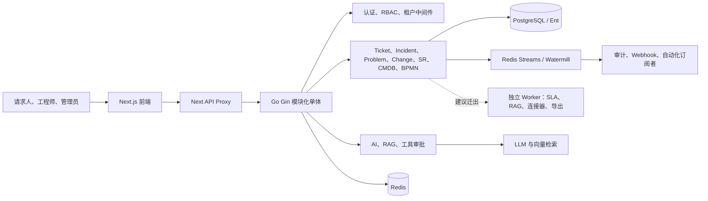

# ITSM 架构与功能评估报告

> 评估日期：2026-08-30
>
> 依据：当前 `main` 分支代码、运行时本地开发验证，以及 [AGENTS.md](../AGENTS.md) 中的领域与架构约束
> （含 2026-08-26 新增的"统一 Work Item 领域模型契约"一节）。
>
> 与既有评估的关系：本次评估对照并核实了
> [architecture-and-roadmap-assessment-2026-08-26.md](./archive/reviews/architecture-and-roadmap-assessment-2026-08-26.md)
> （4 天前，file:line 级证据，现已归档）与更早的
> [architecture-assessment-2026-08.md](./archive/reviews/architecture-assessment-2026-08.md)（现已归档）
> 的结论；凡本文与前两份结论不一致处，均以本次重新核实的代码现状为准，并在正文标注差异原因，
> 不直接假定前份结论仍然成立（08-26 报告本身也记录了一次"分支落后 origin/main 24 个提交导致
> 结论过期"的教训，见其"审批机制单轨化"一节的更新说明，值得作为核实方法参考）。
>
> 范围：ITSM 架构、领域功能闭环、技术债与演进路线；不涵盖组织、预算或管理汇报。

## 1. 架构现状与边界

### 1.1 当前架构判断

系统当前是一个正在向垂直领域模块演进的**模块化单体**：Next.js 前端通过 API Proxy 调用 Go/Gin 后端；后端集中承载领域规则、认证授权、租户边界、工作流和审计；PostgreSQL 是关系型事实源，Redis 提供缓存、序列、限流和 Streams 事件能力；AI、RAG、连接器与 Agent 是扩展面。

不建议当前阶段全面微服务化。ITSM 的工单、事件、问题、变更、审批、SLA 和 CMDB 共享事务、关联关系与权限判断；过早拆分会先引入分布式事务、可观测性和运维成本。更合适的短期目标是：**保持领域 API 单体，先把耗时与可重试的异步执行移入独立 Worker**。

### 1.2 架构优势

| 能力 | 代码事实 | 价值 |
|---|---|---|
| 清晰的业务事实源 | `AGENTS.md` 明确后端是领域规则、RBAC、租户隔离、工作流、审计和 API 合同的唯一事实源。 | 避免前端或连接器复制业务判断。 |
| 统一 WorkItem 方向 | Ticket 是共享身份与横切能力，Incident/Problem/Change/ServiceRequest 使用专业扩展与独立生命周期。 | 兼顾 ITIL 专业状态机与跨域关联、SLA、评论、附件、审计。 |
| 企业级流程能力 | BPMN、任务、审批决策、流程绑定、流程审计已存在；路由已提供工单工作流审批和 Change 审批入口。 | 可承载服务请求履约、CAB、变更窗口与 SLA 升级。 |
| 关系数据能力 | PostgreSQL + Ent 模型覆盖 CMDB 关系、工作项关系、SLA、知识、租户、权限和审计。 | 适合一致性强、查询关系复杂的 ITSM 场景。 |
| 多层安全基础 | JWT、RBAC、Endpoint ACL、租户解析、CSRF、限流、AI 工具审批与审计均已实现。 | 为私有部署、SaaS/MSP 和高风险操作提供基础。 |
| 异步基础已就绪 | Watermill/Redis Streams 已初始化，当前 Ticket、AI triage、SLA 已有生产代码发布事件。 | Webhook、通知、连接器和自动化可逐步脱离同步主链路。 |
| 前端工程基础较完整 | App Router、集中 API Client、权限路由、组件测试、错误页和加载状态均可见。 | 支撑复杂角色界面和 API 合同收敛。 |

### 1.3 架构瓶颈与隐患

#### A. 租户隔离“有中间件、缺最后防线”——但 shadow/enforce 机制本身已经就绪，缺的是灰度执行

租户中间件会校验 JWT 租户并把 `tenant_id` 注入 request context；这是正确的第一层防线。`RLS_MODE` 默认值为 `off`，当前本地运行日志也显示 RLS driver 为 off，若某个 repository、Raw SQL、后台任务或未来扩展遗漏 tenant 条件，数据库不能阻止跨租户读取或写入——这个风险判断成立。

但需要订正的是：`database/rls/driver.go` 显示 `off`/`shadow`/`enforce` 三档模式**已经实现**（"R2A skeleton. off + shadow verified; enforce implemented but disabled until R2B灰度收尾"），项目内部已有命名好的灰度阶段划分（R2A 骨架已完成，R2B 灰度收尾未开始）。也就是说“先建 shadow 模式”这一步已经做完，不是待办事项；真正缺的是**在真实环境里把 `RLS_MODE` 切到 `shadow` 跑起来、收集缺失 tenant 条件的覆盖率数据、按表/模块修复、再推进到 R2B enforce 切换**。

**建议：**核实 shadow 模式是否已在任一环境（预发/生产）实际运行过、当前缺失 tenant 条件的统计结果如何；若尚未运行，第一步是启用 shadow 并接入可观测性，而不是重新设计 shadow 机制；应用中间件仍保留，但不应是唯一隔离保障。

#### B. 旧实现与新垂直切片并存，依赖方向容易失控

后端同时存在 `controller/ + service/ + repository/` 旧结构和 `handlers/<domain>/` 垂直切片。部分 handler 仍直接使用 Ent Client，RouterConfig 聚合了大量 controller/handler；BPMN、Ticket、CMDB、Router 等文件规模较大。这样的状态利于渐进迁移，却会增加跨域读写、事务边界不清和重复实现的概率。

**建议：**每次改动只选择一个权威领域入口；约束 `handler -> application service -> repository -> infrastructure` 的单向依赖，逐域迁移并删除替代路径，而不是永久维护双实现。

#### C. 同步业务提交与事件发布不具备原子性

系统已经不再是“零事件发布者”（`docs/superpowers/specs/2026-08-13-event-bus-wiring-design.md` 记录的当时状态是 `Publish()` 全仓库零调用；目前已有至少一处生产调用，`handlers/ticket/aggregate.go:599`），但数据库提交与 `Publish()` 仍是两步操作。当业务记录成功、Redis 发布失败时，Webhook、审计订阅、连接器或自动化会缺少事件；反之重试也可能产生重复消费。全仓库搜索确认目前没有 `outbox` 相关实现，这是真实缺口，08-13 设计稿也未覆盖 outbox（其状态标注为“不实施——工单生命周期正在重构”，未来接续需求方需要一并确认该设计稿的其余结论是否仍然有效）。

**建议：**在同一领域事务内写 `outbox_events`，由 Worker 可靠发布到 Streams；消费者以事件 ID 做幂等，配置退避重试、死信队列、重放和消费延迟指标。

#### D. 后台任务与 Web 实例耦合

Embedding Pipeline、SLA 监控和升级在 `startBackgroundTasks()` 内由 goroutine/ticker 启动。单实例可用，但多副本时容易重复扫描、重复升级或竞争；进程重启还会丢失内存任务。初始化引擎已实现带 fencing token 的 lease，说明项目具备可复用的分布式协调思想，但尚未统一用于所有后台任务。

**建议：**将 SLA、向量化、Webhook、连接器同步、导出全部迁为独立 Worker/Job；任务状态、重试次数、执行租约和幂等键必须持久化。

#### E. 数据访问和事务边界分散

Ent 是主 ORM，但同时存在原生 `sql.DB`、全局 RawDB 注入、少量 GORM 脚本。原生 SQL 对 pgvector、编号生成和迁移是合理的，但若业务服务随意使用全局 RawDB，会绕开统一事务、RLS 与可测试性约束。

**建议：**保留“基础设施端口”形式的原生 SQL 能力，但隐藏全局 RawDB；由 repository 或 transaction runner 暴露明确接口，所有跨表状态迁移在同一 application transaction 内完成。

#### F. 扩展面尚未真正运行时化

Connector 有 Manifest、Capability、Registry、生命周期和健康检查模型，但内置连接器通过 Go `init()` 编译期注册。AI ToolRegistry 仍以 `switch` 执行工具；ToolQueue 是进程内 channel，无法跨副本、重启恢复或独立审计调度。

**建议：**定义声明式 manifest、版本、权限、配置 schema、签名和隔离执行协议；工具/连接器以 capability 派发，写操作统一进入持久任务队列与审批策略。

### 1.4 目标演进架构

1. **核心 API：**保留领域命令、同步查询、授权、租户解析、审计入口和事务边界。
2. **Worker：**独立执行 SLA、RAG embedding、Webhook、邮件/IM、Connector 同步、导出和长耗时 AI。
3. **Outbox：**领域写操作在同一事务写业务数据、审计和 Outbox；Worker 投递事件。
4. **可观测性：**每个命令、流程任务、事件与 AI 工具调用使用 correlation ID，记录 tenant、actor、来源、结果和延迟。
5. **读优化：**仅在报表、全局搜索和仪表盘出现可量化瓶颈后，引入物化视图/投影；不提前做全面 CQRS。

## 2. ITSM 领域功能闭环

### 2.0 统一 Work Item 模型契约落地核实

AGENTS.md 2026-08-26 新增的"统一 Work Item 领域模型契约"是当前对 Ticket/Incident/Problem/Change/Service Request 关系约束最具体的一节（`recordClass` 创建后不可变、专业扩展表不得复制共享字段、WorkItem 与专业扩展记录必须同事务创建），下面这份评估的领域功能闭环判断以此为准绳重新核实，而不是把这些领域当作互不相关的传统模块看待。

核实结论：

- **模型骨架已落地**：`ent/schema/ticket.go` 已有 `record_class` 字段，`cmd/backfill_incident_work_item`、`cmd/backfill_problem_work_item`、`cmd/backfill_change_work_item` 三个回填 CLI 已存在；`recordClass` 创建后不可变这一约束在 Incident/Problem/Change 的 `repository_impl.go`/`*_service.go` 创建路径的代码注释里被显式提及并遵守（例如 `handlers/change/repository_impl.go:302`、`handlers/problem/repository_impl.go:274`）。
- **共享字段复制问题真实存在，且是团队已知、已显式记录、主动延后处理的技术债**：`service/incident_service.go:160-198` 的创建逻辑里，`title`/`description` 在同一事务内被同时写入 `tx.Ticket.Create()`（WorkItem 权威行）和 `tx.Incident.Create()`（专业扩展行），`ent/schema/incident.go` 也确实定义了自己的 `title`/`description`/`status`/`priority` 字段——这正是契约里"专业扩展表不得复制共享字段"要禁止的模式。代码注释坦承了这一点：状态/优先级只在创建时写一次，后续 Incident 状态机流转（assign/acknowledge/resolve/close/escalate…）不会反写 `tickets.status`，并明确写道"持续双向同步要么是禁止的双写反模式，要么需要同时改遍所有状态转换方法，超出本次事务边界修复的范围，留作独立后续项"。Problem/Change 的扩展表大概率是同一模式（未逐个复核，建议后续评估补齐）。
- **影响**：只要 `tickets.status`/`priority` 在创建之后不再是权威值，任何直接查询 WorkItem 基表（而不是专业扩展表）做统一列表、统一 SLA 计算或跨域报表的代码，读到的字段都可能是创建时刻的快照而非当前真实状态。这是一个比"接口风格不一致"更高优先级的正确性风险，建议单独立项，不要被淹没在其他 P1 治理项里。

**建议：**把"WorkItem 共享字段权威来源收口"列为独立 P1 项——审计 Incident/Problem/Change/Service Request 四个扩展表当前对 `title`/`description`/`status`/`priority` 等共享字段的读写路径，明确"以扩展表为唯一权威、WorkItem 基表只读镜像"或反之，二选一，禁止两边都能写。

### 2.1 核心领域评估

| 领域 | 已实现能力 | 闭环 GAP 与用户影响 | 建议 |
|---|---|---|---|
| Ticket | 创建、分派、评论、附件、关系、SLA、工作流、评分、自动化规则、智能分派。 | `TicketDetail.tsx:283` 的批准动作仍调用 `TicketApi.updateTicketStatus(ticketId, 'approved')`，而真实路径是 BPMN workflow approval；审批人可能直接失败，或绕开应有决策链。核实结论：这是 Ticket 域审批收敛链路上**唯一**仍未收口的活跃问题（`TicketApproval.Create()` 全仓库仅在委派分支出现一次、`ApprovalChain` 仅是流程变量路由的展示元数据、不是竞争写路径），08-26 评估已将其单独列为 P0-3 跟踪，不是新发现；请沿用同一编号避免重复建单。 | 统一只调用 `TicketApprovalApi.submitApproval`/BPMN 接口；补 E2E：授权、拒绝、重复提交、状态推进。 |
| Incident | 生命周期、升级、影响分析、根因、重大事件、转问题、CI 关联。 | 当前前端已有“转为问题”调用，较历史评估已有改进；仍需验证转换后的 WorkItem 关系、审计、权限和失败回滚。 | 建立 Incident→Problem 的真实数据回归集，并在详情页展示关联问题、已知错误与恢复进度。 |
| Problem / Known Error | Problem 调查、根因、解决、关闭；后端已注册 Problem→Known Error 路由。 | 未发现问题详情页调用已知错误创建 API 的前端证据，用户可能无法把根因沉淀为可检索知识。 | 在 Problem 详情提供“发布已知错误”，自动预填根因/绕过方案，并显示知识状态和引用量。 |
| Change / CAB | Change 状态机、风险、审批、排程、实施、回滚、PIR 与 BPMN 集成。 | Change 审批已通过 PR#6（2026-08-25 合并）完整收口到 BPMN——`SubmitChange` 同步触发流程且失败即报错，`TransitionStatus` 的 approve/reject 完全交给 BPMN，`change_approvals`/`change_approval_chains` 写入路径已删除，历史评估里“多套历史审批模型并存”的判断已过期，不应再作为待办列出。真实剩余风险是通用机制层面的：未注册 service task 目前告警后 NoOp，可能导致流程推进但副作用未执行（`service/bpmn_process_engine.go:788,832` 已确认）；`docs/superpowers/specs/2026-08-29-bpmn-async-service-task-design.md`（评估前一天的设计稿）已经在设计相邻但更具体的“暂停型 service task”语义，值得在同一批改动里一并处理 fail-closed 语义。 | 以 BPMN 决策为唯一事实源（已基本达成）；未知任务类型改为 fail-closed 或显式“待处理”，不得静默跳过；结合 08-29 设计稿一并落地。 |
| Service Request / Catalog | 服务目录、动态表单、请求、履约任务、审批链数据。 | 目录项与目标专业领域、SLA、履约/流程绑定的组合需通过配置校验约束，否则管理员可配置出不可执行请求。 | 在发布 Catalog Item 时校验表单、目标 record class、流程、SLA、履约能力和权限。 |
| SLA | SLA 定义、告警规则、监控、升级、统计和仪表盘。 | 监控/升级在 Web 进程内执行，多副本或故障恢复时存在重复或遗漏；升级动作需要更可见的回执。 | Worker 化，记录每次评估/升级的幂等键与执行结果；在工单时间线显示下一 SLA 节点。 |
| CMDB | CI 类型、属性、关系、拓扑、影响分析、导入导出、发现模型。 | 发现/同步的外部执行、结果对账和失败治理决定其真实价值；若只停在任务记录，CMDB 会失去“可信配置基线”。 | 用 Connector Worker 执行发现任务，保证 source-aware reconciliation、幂等导入、差异预览与回滚。 |
| Knowledge / RAG | 知识、版本相关模型、pgvector、关键词降级、引用式检索、AI 对话。 | Embedding 与内容生命周期不完全一致会产生陈旧向量；没有 LLM key 或向量能力时会退化，用户需要知道结果质量。 | 知识发布/下架/删除驱动 outbox embedding job；响应返回来源、版本、权限过滤状态和降级提示。 |
| Connector | Capability、Manifest、Registry、Webhook、Feishu/DingTalk/WeCom/Email 等基础。 | 运行时安装、能力派发、失败重试、入站验证和回放治理仍不足；不同连接器易形成专用分支。 | 建立 connector lifecycle state machine，按 capability 调度，统一 secrets、health、audit、retry/DLQ。 |
| AI / Agent | Triage、总结、RAG、RCA、工具调用、RBAC、工具审批、反馈数据。 | AI 服务不可用时有默认建议；若不显式标示置信度/降级，工程师可能误把启发式建议当模型结论。进程内 ToolQueue 也不可靠。 | 所有建议携带 provider/model/prompt version/confidence/source；高风险工具持久化审批与执行记录。 |

### 2.2 用户体验关键断点

1. **审批入口必须与状态机一致。** 工程师看到“批准”按钮时，应知道审批对象、流程节点、权限、所需意见和执行后的下一节点；禁止用普通状态更新模拟审批。
2. **跨域关联要在 UI 中可见。** Incident→Problem→Known Error→Knowledge、Change→CI→Impact→SLA 应显示关系、状态、责任人和跳转入口，而不只是后端存在 API。
3. **降级必须可解释。** RAG 关键词回退、LLM 未配置、Redis/Connector 失败、异步任务延迟都应以用户可理解的方式显示“能力不可用/结果可信度下降”，不能静默输出看似完整的结果。
4. **异步动作需要可追踪。** 导出、发现、连接器同步、AI 工具、流程自动化需要状态页：排队、执行、重试、失败原因、负责人和重试/取消动作。
5. **管理员配置应在发布前验证。** SLA、流程、Catalog Item、Connector、角色权限的组合必须做依赖检查，减少“保存成功、运行失败”。

## 3. 技术债与架构风险

### P0：正确性、安全与核心流程风险

| 风险 | 根因 | 失败模式 | 修复原则 |
|---|---|---|---|
| 工单审批状态错配 | 前端仍使用普通状态更新，而非 BPMN 审批命令。 | 批准失败、流程不推进、审计/审批决策缺失。 | 一个审批命令、一个事实表、一个 E2E 主链路。 |
| RLS 默认关闭 | 租户中间件正确，但 DB 层未强制。 | 某处遗漏 tenant predicate 即可能跨租户泄露。 | shadow→enforce 渐进切换，应用/管理员 DB 角色分离。 |
| 租户内编号冲突 | WorkItem 收敛后，多个专业域可能独立生成编号；全局唯一与按租户生成语义不一致。 | 创建失败或编号冲突。 | 数据库 `(tenant_id, ticket_number)` 唯一，统一编号服务。 |
| 配置契约漂移 | 环境变量命名、Redis 端口、可选 MinIO 与启动守卫语义未完全统一。 | 本地能启动、目标环境失败；或隐性降级。 | 单一配置 schema、启动 preflight、版本化示例和 Compose 契约测试。 |
| 高风险操作审计不完整 | 审计入口已存在，但要覆盖所有状态迁移、自动化、连接器和批量动作。 | 无法追溯越权、误操作和 Agent 行为。 | 把审计写入领域 application service 的事务边界。 |

### P1：可靠性、维护性与扩展风险

| 风险 | 根因 | 修复原则 |
|---|---|---|
| 事件丢失/重复 | 无 transactional outbox、消费者幂等与 DLQ 约束。 | Outbox、事件 ID、幂等表、retry、DLQ、重放。 |
| 后台任务重复执行 | Goroutine/ticker 绑定所有 API 副本。 | 独立 Worker、租约/分布式锁、任务状态持久化。 |
| 大文件与双轨模块 | Router、BPMN、Ticket、CMDB 责任过多；新旧实现并存。 | 按领域切片重构，迁移完成即删除旧入口。 |
| RawDB 全局可见 | 事务、RLS、测试与连接管理难统一。 | repository port/transaction runner，显式注入。 |
| Connector/Tool 硬编码 | 编译期注册与 switch 分派。 | manifest + capability + 策略注册，运行时启停和版本管理。 |
| BPMN NoOp 任务 | 缺少 handler 时只告警并跳过。 | 关键任务 fail-closed，非关键任务显式标注 skipped 并要求人工确认。 |

### P2：可持续治理风险

| 风险 | 影响 | 建议 |
|---|---|---|
| API DTO 与 `gin.H` 直出并存 | 响应字段和兼容性难治理。 | 统一领域 DTO 与 OpenAPI 合同测试。 |
| 临时/历史文件与迁移遗留 | 增加误读、误编译和维护成本。 | 清理 `.rej`、`.orig`、历史 patch、已废弃 DTO/桥接层。 |
| 测试深度不均衡 | 文件数量不代表关键流程已覆盖。 | 按租户、审批、BPMN、SLA、CMDB 影响分析建立 E2E 矩阵。 |
| AI 评估闭环不足 | 无法证明模型建议带来真实改进。 | 建评测集、反馈闭环、质量阈值和回归门禁。 |

## 4. P0 / P1 / P2 演进路线图

### P0：先恢复正确性与安全边界

| 事项 | 目标与改动边界 | 依赖 | 验收标准 |
|---|---|---|---|
| 统一工单审批 | 前端改用 BPMN 审批 API；删除普通 `approved` 状态写入路径。 | BPMN task/decision API。 | 创建待审批工单后，批准/拒绝均写入 `ProcessApprovalDecision`，流程只推进一次。 |
| 关键流程 E2E | 覆盖 Ticket、Incident→Problem、Problem→Known Error、Change/CAB、Service Request。 | 测试数据、角色矩阵。 | 每链路包含 happy path、权限拒绝、跨租户拒绝、重试/重复提交。 |
| RLS 上线准备 | shadow/enforce driver 已实现（`database/rls`），本项是启用与执行灰度，不是重新建设：在预发/生产启用 `RLS_MODE=shadow`，收集缺 tenant 查询指标并按表/模块修复，再推进 R2B enforce 切换。 | 双角色 DB 账户、迁移。 | 关键租户表在 enforce 下通过集成测试；跨租户读写均被 DB 拒绝。 |
| 编号一致性 | 统一 WorkItem 编号生成与唯一约束。 | 数据迁移与回填评估。 | 并发、多租户、Ticket/Incident/Problem/Change 创建不发生冲突。 |
| 配置 Preflight | 对 DB、Redis、RLS、MinIO、ENV、LLM 配置做启动检查。 | 配置 schema。 | 环境错误在启动前明确失败；可选能力降级有显式状态。 |
| 审计补齐 | 覆盖领域状态迁移、审批、连接器、批量操作和 AI 写动作。 | AuditLog schema/服务。 | 抽样关键动作可追溯 actor、tenant、前后状态、来源和 correlation ID。 |

### P1：建立可靠异步与扩展平台

| 事项 | 目标与改动边界 | 依赖 | 验收标准 |
|---|---|---|---|
| Outbox 与事件治理 | 为 Ticket、Incident、Change、SLA、Connector 事件建立 Outbox。 | DB migration、Worker。 | 业务事务与 Outbox 原子；发布可重试；消费者幂等；具备 DLQ/replay。 |
| Worker 化 | 迁移 SLA、Embedding、Webhook、Connector 同步、导出、长 AI 任务。 | Job state、lease、metrics。 | 多 API 副本不重复执行；Worker 重启可恢复任务。 |
| 审批机制收敛（收尾） | 核实结论：Change 域已通过 PR#6 收口，legacy `ApprovalWorkflow`/`ApprovalRecord` 已下线；剩余范围收窄为——① 修复 P0 中的 `TicketDetail.tsx` 审批接线 bug；② 确认 `TicketApproval`/`ApprovalChain` 两张表当前是否已无活跃写路径，若确认后清理为只读/下线。这是收尾工作，不是重新收敛一个多轨系统。 | P0 项（Ticket 前端接线）先行；数据审计确认后再下线遗留表。 | `TicketApproval`/`ApprovalChain` 无新增写入；确认后按计划下线或明确保留原因。 |
| 模块化重构 | 拆 Router/BPMN/Ticket/CMDB，handler 数据访问下沉 repository。 | 合同测试。 | 领域边界可独立测试；无跨域 repository 直接调用。 |
| 连接器平台 | Manifest、Capability 派发、secret、health、inbound 校验、retry/DLQ。 | Worker、审计、权限策略。 | 新连接器不修改核心业务 switch；生命周期可安装、启停、回滚和审计。 |
| AI 评估与控制台 | 建议/引用/置信度/反馈/工具审批的统一界面和数据模型。 | 审计、反馈表、评测集。 | 可查询每次 AI 建议的来源、质量、采纳与执行结果。 |

### P2：在可量化需求下扩展平台能力

| 事项 | 目标与改动边界 | 前置条件 | 验收标准 |
|---|---|---|---|
| 面向查询的读模型 | 为全局搜索、报表、仪表盘使用投影/物化视图。 | 已测得查询性能瓶颈。 | 查询负载与写模型隔离，数据延迟可观测。 |
| 有选择地拆分服务 | 优先 AI/Connector/Worker；后续才考虑 Workflow/CMDB。 | 明确独立扩缩容、团队所有权或发布节奏需求。 | 每个服务拥有清晰边界、SLO、数据合同与故障恢复方案。 |
| 自主 Agent | 引入 Planner/Executor、策略、预算、隔离执行、人工接管。 | P1 的持久任务、审计和审批已完成。 | Agent 所有写动作可批准、幂等、撤销或回放。 |
| 多模态与私有模型 | 处理日志、截图、拓扑、语音/图像工单；支持本地推理。 | 数据分类、脱敏、模型治理。 | 输入输出可审计、敏感信息不泄露、引用可追溯。 |
| 多区域/MSP 深化 | 用量计量、数据驻留、灾备、客户自管密钥。 | RLS、Worker、事件可靠性稳定。 | 租户隔离、恢复演练和区域故障切换有自动化验证。 |

---

## 代码证据索引

- 架构与领域约束：[AGENTS.md](../AGENTS.md)
- 应用组装、事件订阅、后台任务：[internal/bootstrap/app.go](../itsm-backend/internal/bootstrap/app.go)
- 路由与权限边界：[router/router.go](../itsm-backend/router/router.go)
- 租户中间件：[middleware/tenant.go](../itsm-backend/middleware/tenant.go)
- RLS 配置与 driver：[config/config.go](../itsm-backend/config/config.go)、[database/rls](../itsm-backend/database/rls)
- 事件总线：[pkg/eventbus](../itsm-backend/pkg/eventbus)
- AI 工具 RBAC/审批/审计：[handlers/ai/service.go](../itsm-backend/handlers/ai/service.go)
- 工单审批客户端：[ticket-approval-api.ts](../itsm-frontend/src/lib/api/ticket-approval-api.ts)
- 当前错误审批调用：[TicketDetail.tsx](../itsm-frontend/src/components/ticket/TicketDetail.tsx)
- Incident 转 Problem：[incident-api.ts](../itsm-frontend/src/lib/api/incident-api.ts)、[IncidentDetail.tsx](../itsm-frontend/src/components/incident/IncidentDetail.tsx)
- WorkItem 共享字段双写示例：[service/incident_service.go](../itsm-backend/service/incident_service.go)、[ent/schema/incident.go](../itsm-backend/ent/schema/incident.go)、[handlers/change/repository_impl.go](../itsm-backend/handlers/change/repository_impl.go)、[handlers/problem/repository_impl.go](../itsm-backend/handlers/problem/repository_impl.go)
- BPMN 未注册 service task 的 NoOp 行为：[service/bpmn_process_engine.go](../itsm-backend/service/bpmn_process_engine.go)

### 既有评估与设计稿（本次核实对照的前置文档）

- [architecture-and-roadmap-assessment-2026-08-26.md](./archive/reviews/architecture-and-roadmap-assessment-2026-08-26.md) — 4 天前的架构诊断，file:line 级证据，本次评估的主要对照基线（现已归档）
- [architecture-assessment-2026-08.md](./archive/reviews/architecture-assessment-2026-08.md) — 更早一轮评估（现已归档）
- [superpowers/specs/2026-08-26-approval-single-track-convergence-design.md](./archive/reviews/2026-08-26-approval-single-track-convergence-design.md) — 审批单轨化收尾核实，确认 Change 域已通过 PR#6 收口（现已归档）
- [superpowers/specs/2026-08-13-event-bus-wiring-design.md](./superpowers/specs/2026-08-13-event-bus-wiring-design.md) — 事件总线现状盘点（当时 `Publish()` 零调用）
- [superpowers/specs/2026-08-29-bpmn-async-service-task-design.md](./superpowers/specs/2026-08-29-bpmn-async-service-task-design.md) — 暂停型 service task 执行语义设计，与本报告 BPMN NoOp 发现相邻
- [superpowers/specs/2026-08-26-unified-work-item-model-design.md](./superpowers/specs/2026-08-26-unified-work-item-model-design.md) — 统一 WorkItem 模型详细设计，AGENTS.md 对应契约的完整版本
