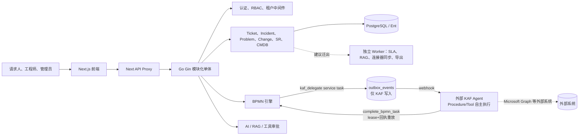

# ITSM 架构与功能评估报告

> 评估日期：2026-09-01
>
> 依据：当前 `main` 分支代码（HEAD `fda84251`）、[AGENTS.md](../AGENTS.md) 架构与领域契约、以及对代码库的直接核查（含一次针对 6 项关键技术债的独立重新核查，避免直接沿用旧结论）。
>
> 与既有评估的关系：本报告以
> [architecture-product-assessment-2026-08-30.md](./architecture-product-assessment-2026-08-30.md)（2 天前，file:line 级证据）为基线，**逐项重新核查其结论是否仍然成立**，而不是假定 2 天前的判断依然准确——事实上，本次核查推翻或修正了其中 3 项结论（RLS 接线状态、ticket_number 冲突严重度、BPMN 跨租户数据泄露修复状态），并发现了一个 08-30 报告完全未覆盖的新架构面：**KAF 自主 Agent 通过 BPMN 委派接管 WorkItem 执行**（2026-08-28~08-31 合入 main）。所有与 08-30 报告结论不一致之处均在正文标注「订正」并给出依据，其余未标注部分视为核查后仍然成立。
>
> 范围：ITSM 架构、领域功能闭环、技术债与演进路线；不涵盖组织、预算或管理汇报。

---

## 1. 系统架构与技术评估

### 1.1 架构现状判断

系统是一个**正在向垂直领域模块演进的模块化单体**，外加一个刚刚落地的**外部自主 Agent 委派面**：Next.js 前端通过 API Proxy 调用 Go/Gin 后端；后端集中承载领域规则、认证授权、租户边界、工作流和审计；PostgreSQL 是关系型事实源；BPMN 引擎新增了 `kaf_delegate` 异步 service task，可以把一个 WorkItem 的执行权“借出”给外部 KAF Agent，再通过回执收敛回 ITSM 的事实源。

不建议现阶段全面微服务化：工单、事件、问题、变更、审批、SLA 和 CMDB 共享事务、关联关系与权限判断，过早拆分会先引入分布式事务、可观测性和运维成本。更合适的短期目标依然是**领域 API 保持单体，把耗时/可重试/跨系统的执行迁入独立 Worker 与 Outbox**——KAF 委派链路已经证明了这条路径在本代码库里可行（见 1.3-G）。

### 1.2 架构优势

| 能力 | 代码事实 | 价值 |
|---|---|---|
| 清晰的业务事实源 | AGENTS.md 明确后端是领域规则、RBAC、租户隔离、工作流、审计的唯一事实源；KAF 设计文档进一步重申"KAF 可以更新/推进/关闭 WorkItem，但不能直接写 ITSM 数据库或绕过领域规则"。 | 即便引入外部 Agent，也没有产生第二个事实源。 |
| 统一 WorkItem 方向 | `record_class` 字段、跨域回填 CLI（`cmd/backfill_incident_work_item` 等）已落地。 | 兼顾专业状态机与跨域关联、SLA、评论、审计。 |
| 企业级流程能力 | BPMN、任务、审批决策、流程绑定已存在；Change 审批已通过 PR#6 完整收口到 BPMN，`change_approvals`/`change_approval_chains` 遗留表已删除。 | 单一审批事实源，减少"哪张表说了算"的歧义。 |
| **一个真实、可回放的委派可靠性范式** | KAF 委派链路实现了：`ProcessTask` 挂起/恢复、事务性 Outbox、delivery lease + fencing token、幂等 `taskId+runId+stepId`、completion payload **replay-only** 语义、monotonic receipt（晚到的失败不能覆盖已成功的回执）。 | 这不是纸面设计——`docs/reports/2026-08-30-kaf-delegation-execution-integrity-report.md` 有具体回归测试证明"commit 后失败仍收敛为一次副作用""重放不会重复执行 Procedure"。这套范式值得作为平台能力复用到其他连接器/AI 工具执行（见 1.3-F/G）。 |
| 多层安全基础 | JWT、RBAC（已完成单轨化收敛，见 2.1）、Endpoint ACL、CSRF、限流均已实现。 | 为私有部署、SaaS/MSP 和高风险操作提供基础。 |
| 前端正在主动收紧"菜单即权限"漏洞 | 当前工作区有一批**未提交**改动：`Sidebar.tsx` 删除了 `isAdmin = user?.role === 'admin'` 前端角色推断和静态菜单 fallback，改为"后端菜单未加载时 fail closed，不渲染任何菜单"（`Sidebar.tsx` diff，2026-09-01）。 | 直接对应 AGENTS.md"隐藏菜单不是授权"的原则，是当前 P0 工作里少见的、正在被主动修复的一项。 |

### 1.3 架构瓶颈与隐患

#### A. RLS driver 已接入连接路径，但只做观测，真正的 tenant session 设置从未被调用（订正：本节此前的版本有事实错误，见下）

**订正说明（2026-09-02 补充）**：本节最初的版本引用一次后台核查的 grep 结果，断言"`internal/bootstrap/*.go`、`main.go` 中没有任何地方引用 `rls` 包"。这个结论是**错的**——那次 grep 只匹配了小写字面量 `rls\.`，漏掉了 `internal/bootstrap/app.go` 两处实际调用的 `database.InitDatabaseWithRLS(&cfg.Database, &cfg.RLS, sugar)`（大小写不同的驼峰命名）。这个接线本来就在 `main` 上，不是新代码。这次错误是在审阅另一份设计文档（`docs/architecture-hardening-agent-platform-evolution-design.md`）时交叉核实发现的，教训是：子 agent 的 grep 式核查不能直接采信为事实，尤其是大小写/驼峰混用的符号名。

真实情况：`database/database.go` 的 `InitDatabaseWithRLS` **确实**在 DB 初始化时把 SQL driver 包一层 RLS 装饰器（`off` 模式下是纯 no-op；`shadow`/`enforce` 模式下会审计/统计缺 tenant 条件的查询），`internal/bootstrap/app.go` 两处启动路径都调用它，不是死代码。但装饰器本身**故意不**执行 `SET LOCAL`/`SET SESSION` 设置 tenant 变量——这一步被设计成必须由 `rls.AcquireConn`（`database/rls/rls.go:67`）或 middleware 显式调用，而全仓库对 `AcquireConn` 的调用点是**零**（唯一"引用"是源码注释里的示例代码）。也没有任何 middleware 做 `SET LOCAL app.current_tenant`。`config.go` 默认 `RLS.Mode = "off"`，`docker-compose*.yml`/`.env.example` 均未设置 `RLS_MODE`，因此不存在任何环境曾经跑过 shadow 模式。**结论不变**（RLS 目前不提供任何真实的跨租户防护），但准确的描述是"观测装饰器已接线，真正的 enforcement 钩子从未被调用"，不是"完全没有接入连接路径"。

更值得注意的是，这不是纯历史债务：8 月底新增的 KAF 委派功能带来了两张新的租户表，其 RLS 迁移（`019_kaf_execution_integrity_rls`）已经写好并会 `ENABLE`/`FORCE` policy，但对应的 PostgreSQL 集成测试"**compile but skip without `RLS_TEST_DSN`**"（KAF 验收报告原文）——也就是说新功能仍然在延续"RLS 只存在于代码里，没有在真实环境验证过"的模式。

**建议：**把"让 `AcquireConn`（或等价 middleware）在每个请求路径上真正被调用、设置 tenant session 变量"作为独立第一步，与"灰度到 shadow 收集覆盖率数据"分开验收；不能满足于"driver 已经装饰了 SQL 连接"就判定这项风险已缓解——观测和真正的强制执行是两回事。

#### B. 旧实现与新垂直切片并存，依赖方向容易失控

`controller/`（`cmdb_controller.go` 1879 行、`ticket_controller.go` 1211 行、`incident_controller.go` 1328 行、`bpmn_workflow_controller.go` 1111 行；`router/router.go` 1749 行、`service/bpmn_process_engine.go` 3359 行）与 `handlers/<domain>/` 垂直切片并存（2026-09-01 实测行数，较 08-04 记录的基线有小幅波动，说明尚未开始系统性瘦身）。

**建议：**每次改动只选择一个权威领域入口；约束 `handler -> application service -> repository -> infrastructure` 单向依赖，逐域迁移并删除旧路径。

#### C. Outbox 已经落地，但只服务一条链路（订正：08-30 报告"全仓库无 outbox"已过期）

`ent/schema/outbox_event.go` 定义的是一张**通用**表（`event_type`/`aggregate_type`/`aggregate_id`/`payload`），但全仓库唯一的写入点是 `service/kaf_delegation_service.go:974` 的 `s.outbox.Enqueue(...)`，`internal/bootstrap/app.go:202` 也只为 KAF 场景装配了这个 repository。Ticket/Incident/Change/SLA 等其他领域事件仍然只靠 `pkg/eventbus`（进程内、非持久化）发布，08-30 报告指出的"提交与发布非原子"问题在这些领域依然成立。

**好消息**：需要的表结构和"事务内写 outbox、Worker 异步投递、幂等消费"这套模式已经被 KAF 场景验证过（见 1.2），P1 阶段要做的不是从零设计 outbox，而是把 `OutboxRepository` 的写入点从 KAF 一个 service 扩展到 Ticket/Incident/Change/SLA 等领域 service 的事务边界内。

**建议：**审计 KAF outbox 的 Worker 投递/重试/DLQ 实现是否足够通用，若是，直接复用给其他领域；若 KAF 特化过深，抽出通用部分。

#### D. 后台任务与 Web 实例耦合

Embedding Pipeline、SLA 监控和升级仍在 `startBackgroundTasks()` 内由 goroutine/ticker 启动，多副本部署时会重复扫描/重复升级，进程重启丢失内存任务状态。

**建议：**迁为独立 Worker/Job，任务状态、重试次数、执行租约和幂等键持久化——沿用 KAF 委派已经验证过的 lease+fencing token 模式。

#### E. 数据访问和事务边界分散

Ent 是主 ORM，同时存在全局 RawDB 注入和少量原生 SQL，若业务服务随意使用全局 RawDB 会绕开统一事务与 RLS 约束（尤其在 A 项修复后，RawDB 路径会成为绕过 RLS 的天然后门）。

**建议：**保留原生 SQL 能力但隐藏全局 RawDB，由 repository/transaction runner 暴露明确接口。

#### F. 连接器/工具尚未真正运行时化

内置连接器仍通过 Go `init()` 编译期注册；AI ToolRegistry 仍以 `switch` 执行工具；ToolQueue 是进程内 channel，无法跨副本/重启恢复。

**建议：**定义声明式 manifest、版本、权限、配置 schema，工具/连接器以 capability 派发——这一点上 KAF 委派已经提供了一个可参考的"外部执行体 + 任务范围 token + 幂等边界"的实现范例（`KafDelegationService` 的 per-task 授权：`kaf_automation` 角色 + 任务租户 + `delegated` 状态三重校验），可以作为 Connector Worker 的设计起点，而不必另起炉灶。

#### G.（新增）多 Agent 协作的可靠性范式已验证，但覆盖面、生产就绪度和权限边界都还窄

这是本次评估新发现、直接对应用户关心的"复杂多 Agent 协作"问题的核心证据：

- **已验证的能力边界**：KAF 委派的验收报告明确给出了正/反例证据——commit-then-error 场景收敛为一次副作用、迟到的失败不能覆盖已成功的回执（monotonic receipt）、持久化的 completion payload 之后只能 replay 不能重新执行 Procedure/Tool（对接 Microsoft Graph 这类有副作用的外部系统是刚需）。这是目前仓库里对"外部 Agent 写回权威系统"这一问题回答得最完整的一份实现。
- **但状态仍是"Dev 受控集成，非生产就绪"**：验收报告原文——"accepted for controlled Dev integration, not yet for production rollout"，一次带真实凭据的跨进程 SSLVPN 全链路验证仍待执行；RLS 集成测试在真实 Postgres 下仍是 skip 而非通过。
- **场景覆盖极窄**：目前唯一打通的是 `service_request_item` 的 SSLVPN 权限开通这一个 Procedure；Problem/Change、人工接管、用户追问恢复、审批恢复均显式排除在范围外（设计文档 §"明确不包含"）。
- **BPMN 未注册 service task 仍是 NoOp**：`service/bpmn_process_engine.go:788,832` 对未注册 handler 目前告警后跳过，这与 AGENTS.md「Fail-Closed Dispatch」原则冲突——当 KAF 委派节点因配置错误未被注册时，流程会静默"继续"而不是阻塞，这个通用问题恰好会在委派语义扩展到更多场景时放大影响面。

**建议：**在把 KAF 模式推广到更多场景（Problem/Change、更多 Procedure）之前，先把"未注册 service task 必须 fail-closed"补齐为通用能力，并完成一次真实跨进程验收；不要在 fail-closed 语义补齐之前扩大委派的场景面。

### 1.4 目标演进架构

1. **核心 API：**保留领域命令、同步查询、授权、租户解析、审计入口和事务边界。
2. **Worker：**独立执行 SLA、RAG embedding、Webhook、Connector 同步、导出和长耗时 AI/委派任务；复用 KAF 委派已验证的 lease+fencing token 模式。
3. **Outbox：**把已验证的 KAF outbox 写入模式扩展到 Ticket/Incident/Change/SLA 等领域事务边界内。
4. **RLS：**先让 `AcquireConn`/middleware 在真实请求路径上被调用、设置 tenant session 变量，再谈 shadow 灰度收集覆盖率数据，两步不能合并汇报为一步。
5. **可观测性：**每个命令、流程任务、事件与 AI/Agent 工具调用使用 correlation ID，记录 tenant、actor、来源、结果和延迟。
6. **读优化：**仅在报表、全局搜索和仪表盘出现可量化瓶颈后引入物化视图，不提前做全面 CQRS。

---

## 2. 功能缺陷与体验洞察（GAP 分析）

### 2.0 WorkItem 共享字段权威来源（沿用 08-30 结论，仍未修复）

`service/incident_service.go` 的创建逻辑在同一事务内把 `title`/`description` 同时写入 `tx.Ticket.Create()`（WorkItem 权威行）和 `tx.Incident.Create()`（专业扩展行），但后续 Incident 状态机流转不会反写 `tickets.status`/`priority`。任何直接查询 WorkItem 基表做统一列表、统一 SLA 计算或跨域报表的代码，读到的字段可能是创建时刻的快照而非当前真实状态。**这一项与 1.3-A（SLA 从未应用到这三个域）实际上是同一根因的两个症状**：Incident/Problem/Change 的 WorkItem 行从一开始就没有走 `TicketService.CreateTicket` 这条唯一权威路径，因此既没有真实 SLA 绑定，共享字段也没有单一写入点。**建议把这两项合并为一个 P0 项处理，而不是分开排期**——否则先修 SLA 绑定、再修字段权威来源，会导致同一段创建路径被改两次。

### 2.1 核心领域评估

| 领域 | 已实现能力 | 闭环 GAP 与用户影响 | 建议 |
|---|---|---|---|
| Ticket | 创建、分派、评论、附件、关系、SLA、工作流、自动化规则、智能分派。 | **订正（2026-09-02，在审阅另一份设计文档时重新核实）**：这不只是 `TicketDetail.tsx` 前端接线问题。`service/ticket_workflow_service.go` 的审批处理逻辑在同一次操作里，既调用 `approvalBridge` 桥接 BPMN，又独立维护 `TicketApproval` 表并根据自己的"待审批数是否为 0"判断直接把 `tickets.status` 改成 `approved`/`rejected`——这条状态写入路径完全不经过 BPMN。是当前活跃代码，不是历史死代码，违反 AGENTS.md"BPMN 是审批唯一编排层"的约束。 | 不能只改前端调用哪个 API：`ticket_workflow_service.go` 里独立维护 `TicketApproval` 生命周期和直接写 `tickets.status` 的逻辑需要在同一批改动里删除，审批决策的状态写入收敛到 BPMN 单一路径；补齐 E2E：授权、拒绝、重复提交、状态推进。 |
| Incident | 生命周期、升级、影响分析、根因、重大事件、转问题、CI 关联。 | 无真实 SLA 绑定（2.0）；`title`/`status` 双写但不回写（2.0）。 | 与 2.0 合并修复：让 Incident/Problem/Change 创建路径复用 `TicketService` 的 SLA 分配与单一写入逻辑。 |
| Problem / Known Error | Problem 调查、根因、解决、关闭。 | 同上；另编号生成逻辑与 Incident/Change 不一致（见 3.P0）。 | 同上，且需在同一批改动里统一编号生成。 |
| Change / CAB | 状态机、风险、审批、排程、实施、回滚、PIR 与 BPMN 集成。 | 审批已通过 PR#6 完整收口到 BPMN，`change_approvals`/`change_approval_chains` 遗留表已删除——此前"多套审批模型并存"的判断已过期，不应再列为待办。 | 剩余风险已收窄为通用机制层（1.3-G 的 fail-closed），不再是 Change 域专属问题。 |
| Service Request / Catalog | 服务目录、动态表单、请求、履约任务；新增 KAF 委派入口。 | 目录项与目标专业域、SLA、履约/流程绑定的组合缺配置期校验；KAF 委派目前仅覆盖 SSLVPN 一个 Procedure。 | 发布 Catalog Item 时校验表单/recordClass/流程/SLA/履约能力组合；委派场景扩展前先补 fail-closed（1.3-G）。 |
| SLA | SLA 定义、告警规则、监控、升级、统计仪表盘。 | 监控逻辑只查询 `tickets` 表且只对纯 Ticket 生效（1.3-A 已确认）；Web 进程内执行，多副本存在重复/遗漏风险。 | Worker 化 + 幂等键；同步修复 Incident/Problem/Change 的 SLA 绑定缺失。 |
| CMDB | CI 类型、属性、关系、拓扑、影响分析、导入导出。 | 发现/同步的外部执行、结果对账和失败治理决定其真实价值。 | 用 Connector Worker 执行发现任务，保证幂等导入与差异预览。 |
| Knowledge / RAG | 知识、版本模型、pgvector、关键词降级、引用式检索。 | Embedding 与内容生命周期不完全一致会产生陈旧向量。 | 知识发布/下架驱动 outbox embedding job（复用 1.3-C 的通用化 outbox）。 |
| Connector | Capability、Manifest、Registry、Webhook 基础；新增 KAF 委派这一实质性范例。 | 运行时安装、能力派发、失败重试仍不足；不同连接器易形成专用分支。 | 以 KAF 委派的 lease/幂等/回放范式为模板，建立 connector lifecycle state machine。 |
| AI / Agent | Triage、总结、RAG、RCA、工具调用、RBAC、工具审批；新增 KAF 自主委派（跨系统写权限）。 | KAF 委派已具备较完整的可靠性证据，但仍是 Dev-only、单场景；BPMN 未注册任务仍 NoOp（1.3-G）。 | 生产准入前必须补齐 fail-closed 语义并完成真实跨进程验收，再谈场景扩展。 |

### 2.2 进行中的前端修复（正面信号，未提交）

当前工作区有一批未提交改动，方向是"移除前端静态菜单/角色推断，后端菜单唯一权威、fail closed"：`Sidebar.tsx` 删除了 `isAdmin` 前端角色判断和 `getMenuConfig()` 静态 fallback；`route-config.ts`/`menu-config.ts` 把 `admin` 权限资源从裸的 `admin:read` 改为与 seeder 一致的 `system:read`；`admin/overview/page.tsx` 从一个纯重定向页变成真实的仪表盘组件。这与 AGENTS.md"隐藏菜单不是授权"的原则和第 2.1 节 Ticket 审批接线问题属于同一类"前端曾经替后端做判断"的问题模式。**建议在合入前补一条回归测试**：验证后端菜单接口失败/为空时，管理员菜单不会退化到显示（当前逻辑是 `dynamicMenus ? convertApiMenuToSidebar(...) : []`，需要确认没有遗留调用方仍依赖旧的 `role-routes.ts`——该文件在本次改动中已被删除）。

### 2.3 用户体验关键断点

1. **审批入口必须与状态机一致。** 工程师看到"批准"按钮时应知道审批对象、流程节点、权限、所需意见和执行后的下一节点。
2. **跨域关联要在 UI 中可见。** Incident→Problem→Known Error、Change→CI→Impact→SLA 应显示关系、状态、责任人和跳转入口。
3. **降级必须可解释。** RAG 关键词回退、LLM 未配置、Redis/Connector 失败、**KAF 委派任务卡在等待外部 Agent** 都应以用户可理解的方式显示"能力不可用/结果可信度下降/等待外部处理中"，不能静默输出看似完整的结果。
4. **异步动作需要可追踪。** 导出、发现、连接器同步、**KAF 委派任务**、流程自动化需要状态页：排队、执行中、重试、失败原因、负责人和重试/取消动作。KAF 委派目前有完整的后端 action ledger/completion receipt，但尚未确认前端是否把这些状态暴露给最终用户/工程师——建议核实。
5. **管理员配置应在发布前验证。** SLA、流程、Catalog Item、Connector、角色权限的组合必须做依赖检查，减少"保存成功、运行失败"。

---

## 3. P0 / P1 / P2 演进路线图

### P0：正确性、安全与核心流程风险

| 事项 | 目标与改动边界 | 依赖 | 验收标准 |
|---|---|---|---|
| **WorkItem 创建路径统一（含 SLA 绑定）** | Incident/Problem/Change 的创建改为复用 `TicketService.CreateTicket` 的 SLA 分配与单一字段写入逻辑，而不是各自 `tx.Ticket.Create()`。 | 无（现有代码路径内收敛）。 | 三个域新建的 WorkItem 都有真实 `sla_definition_id`/deadline；状态流转后 `tickets.status` 与专业扩展表一致，不再是创建时快照。 |
| **ticket_number 编号统一** | Ent schema 唯一约束改为 `(tenant_id, ticket_number)`；把 Incident/Problem/Change 三处相互矛盾的生成实现（租户维度 vs 全局维度）收敛为一个共享生成器。 | 数据迁移与回填评估。 | 并发、多租户、四个域创建不发生冲突；仓库内只有一处编号生成实现。 |
| **RLS enforcement 钩子真正接线** | `database/rls` driver 已经在 `internal/bootstrap` 接入 DB 初始化（观测层），本项要做的是让 `rls.AcquireConn`（或等价 middleware）在真实请求路径上被调用、真正设置 tenant session 变量，再启用 shadow 并收集缺失 tenant 条件的覆盖率数据。 | 双角色 DB 账户、迁移。 | `RLS_TEST_DSN` 下的集成测试从"skip"变为"实际执行且通过"；至少一个非 Dev 环境跑过 shadow 模式并有覆盖率数据。 |
| **BPMN fail-closed 语义补齐** | 未注册 service task（含 `kaf_delegate` 配置错误的情形）从"告警后 NoOp"改为显式阻塞/待人工处理状态，并产生审计与可观测指标。 | `docs/superpowers/specs/2026-08-29-bpmn-async-service-task-design.md`。 | 未注册任务类型不再让流程静默推进；有告警指标可查。 |
| **工单审批双轨收口（前端+后端）** | 前端改用 BPMN 审批 API；`service/ticket_workflow_service.go` 删除独立维护 `TicketApproval` 生命周期和直接写 `tickets.status` 的逻辑，审批状态只经 BPMN 一条路径写入。 | BPMN task/decision API。 | 批准/拒绝均只写入审批决策记录，`tickets.status` 无非 BPMN 写入口，流程只推进一次。 |
| **审计补齐** | `AuditMiddleware` 挂载到 `router.go`（当前定义存在但零挂载点，`handlers/known_error` 已经因此被迫手工写审计绕过它）；覆盖领域状态迁移、审批、连接器、KAF 委派和批量操作。 | AuditLog schema/服务。 | 抽样关键动作可追溯 actor、tenant、前后状态、来源和 correlation ID，不再需要各域手工绕过。 |

### P1：建立可靠异步与扩展平台

| 事项 | 目标与改动边界 | 依赖 | 验收标准 |
|---|---|---|---|
| **Outbox 通用化** | 把 KAF 场景验证过的 `OutboxRepository` 写入模式扩展到 Ticket/Incident/Change/SLA 等领域 service 的事务边界内；复用而非重建。 | Worker 投递能力（KAF 已有雏形）。 | 业务事务与 Outbox 原子；发布可重试；消费者幂等；具备 DLQ/replay。 |
| **Worker 化** | 迁移 SLA、Embedding、Webhook、Connector 同步、导出；复用 KAF 委派的 lease+fencing token 模式而非另起一套。 | Job state、metrics。 | 多 API 副本不重复执行；Worker 重启可恢复任务。 |
| **KAF 委派场景与生产准入** | 完成一次真实跨进程验收（含真实凭据、真实 RLS 探针），走完 P0 的 fail-closed 补齐后再评估扩展到 Problem/Change 或更多 Procedure。 | P0 的 fail-closed 与 RLS 接入。 | Live Dev Closeout 通过；有独立的生产准入评审记录，不与 Dev 验收混为一谈。 |
| **连接器/工具平台化** | Manifest、Capability 派发、secret、health、inbound 校验、retry/DLQ；以 KAF 的 per-task 授权模型为参考。 | Worker、审计、权限策略。 | 新连接器不修改核心业务 switch；生命周期可安装、启停、回滚和审计。 |
| **模块化重构** | 拆 Router/BPMN/CMDB/Ticket 大文件，handler 数据访问下沉 repository。 | 合同测试。 | 领域边界可独立测试；无跨域 repository 直接调用。 |
| **AI 评估与控制台** | 建议/引用/置信度/反馈/工具审批的统一界面和数据模型，覆盖 KAF 委派的 procedure 选择置信度。 | 审计、反馈表、评测集。 | 可查询每次 AI/Agent 建议的来源、质量、采纳与执行结果。 |

### P2：在可量化需求下扩展平台能力

| 事项 | 目标与改动边界 | 前置条件 | 验收标准 |
|---|---|---|---|
| **面向查询的读模型** | 为全局搜索、报表、仪表盘使用投影/物化视图。 | 已测得查询性能瓶颈。 | 查询负载与写模型隔离，数据延迟可观测。 |
| **自主 Agent 场景扩展** | 在 KAF 委派已验证的可靠性范式基础上，扩展到 Problem/Change、更多 Procedure，及人工接管/审批恢复等当前显式排除的场景。 | P0/P1 的 fail-closed、RLS、生产准入完成。 | 每个新场景复用同一套 lease/幂等/回放/审计机制，不产生场景专属分支。 |
| **有选择地拆分服务** | 优先 AI/Connector/Worker；后续才考虑 Workflow/CMDB。 | 明确独立扩缩容或团队所有权需求。 | 每个服务拥有清晰边界、SLO、数据合同与故障恢复方案。 |
| **多模态与私有模型** | 处理日志、截图、拓扑、语音/图像工单；支持本地推理。 | 数据分类、脱敏、模型治理。 | 输入输出可审计、敏感信息不泄露。 |
| **多区域/MSP 深化** | 用量计量、数据驻留、灾备、客户自管密钥。 | RLS、Worker、事件可靠性稳定。 | 租户隔离、恢复演练和区域故障切换有自动化验证。 |

---

## 4. 可量化评估指标（KPI / Metric 建议）

| 指标 | 定义 | 当前基线（据本次核查） | 目标 | 用途 |
|---|---|---|---|---|
| **租户隔离验证覆盖率** | 通过 `RLS_TEST_DSN` 实际执行（非 skip）并通过 enforce 模式集成测试的租户表占比 | 0%（`AcquireConn`/tenant session 设置从未被调用，观测装饰器不提供真实隔离，相关测试均 skip） | 关键租户表（tickets/incidents/problems/changes/outbox_event 等）100% | 衡量 P0 RLS enforcement 钩子接线工作的真实进度，避免"driver 已装饰连接=已完成"的误判 |
| **WorkItem 数据一致性事故数** | ticket_number 冲突、专业扩展表与 WorkItem 基表字段不一致导致的线上问题数 | 已知至少 1 类结构性冲突（3 处生成器互相矛盾），当前无监控 | 0 起 / 季度，且有自动化回归测试防止复发 | 衡量 P0 编号统一 + 共享字段收口是否真正闭环 |
| **高风险操作审计覆盖率** | 审批、批量操作、连接器回调、AI/Agent 写动作中实际产生审计记录的比例 | AuditMiddleware 零挂载，覆盖率不可测量（无法验证） | ≥ 99%，且可通过 correlation ID 端到端追溯 | 直接对应 AGENTS.md 安全合规要求，也是 P0 审计补齐的验收依据 |
| **Agent/自动化委派完成率与人工介入率** | KAF 委派任务中免人工完成的比例、平均完成时长、需要人工接管的比例 | 仅 1 个 Procedure（SSLVPN）有 Dev 环境数据，尚无生产数据 | 分场景设定目标（如 SSLVPN 类 ≥ 90% 免人工），并按月跟踪扩展场景的完成率变化 | 决定 P1/P2 是否应该扩展更多委派场景，避免"能力已验证但没人知道效果"的盲扩 |
| **事件可靠性（Outbox 覆盖度 + DLQ 量）** | 已接入事务性 Outbox 的领域事件类型占比；消费者产生的死信/重复消费数量 | 仅 KAF 委派 1 类事件接入 Outbox，其余领域仍依赖非持久化 eventbus | Ticket/Incident/Change/SLA 关键事件 100% 接入；DLQ 量可观测且有告警阈值 | 衡量 P1 Outbox 通用化的推进节奏，防止"重要事件丢失"类故障 |

---

## 代码证据索引

- 架构与领域约束：[AGENTS.md](../AGENTS.md)
- KAF 委派设计：[2026-08-28-kaf-itsm-autonomous-workitem-delegation-design.md](./superpowers/specs/2026-08-28-kaf-itsm-autonomous-workitem-delegation-design.md)、[2026-08-31-kaf-delegation-release-closeout-design.md](./superpowers/specs/2026-08-31-kaf-delegation-release-closeout-design.md)
- KAF 验收报告（Dev-only 结论、RLS skip 证据）：[2026-08-30-kaf-delegation-execution-integrity-report.md](./reports/2026-08-30-kaf-delegation-execution-integrity-report.md)
- Outbox schema 与唯一写入点：`itsm-backend/ent/schema/outbox_event.go`、`itsm-backend/service/kaf_delegation_service.go:974`、`itsm-backend/internal/bootstrap/app.go:202`
- RLS 装饰器接线（观测层）：`itsm-backend/database/database.go:225-253`（`InitDatabaseWithRLS`）、`itsm-backend/internal/bootstrap/app.go:234,1091`
- RLS 真正 enforcement 从未接线证据：`itsm-backend/database/rls/rls.go:67`（`AcquireConn`，全仓库零调用点）、`itsm-backend/config/config.go:307-311`（默认 `Mode=off`）
- SLA 缺失绑定证据：`itsm-backend/service/sla_monitor_service.go:107-134`、`itsm-backend/service/incident_service.go:160-198`
- 编号冲突三处实现：`itsm-backend/service/incident_service.go:1096`、`itsm-backend/handlers/problem/repository_impl.go:374-389`、`itsm-backend/handlers/change/repository_impl.go:407-414`
- AuditMiddleware 未挂载：`itsm-backend/middleware/audit.go:78`、`itsm-backend/router/router.go`、`itsm-backend/handlers/known_error/handler.go:601-609`
- BPMN 跨租户过滤（已修复）：`itsm-backend/service/bpmn_process_engine.go`（`GetProcessInstance`/`GetTask`/`ListUserTasks`）
- 前端菜单权威改造（未提交）：`itsm-frontend/src/components/layout/sidebar/Sidebar.tsx`、`itsm-frontend/src/lib/router/route-config.ts`

### 既有评估与设计稿（本次核实对照的前置文档）

- [architecture-product-assessment-2026-08-30.md](./architecture-product-assessment-2026-08-30.md) — 本报告的对照基线，3 项结论本次被订正（见各节标注）
- [superpowers/specs/2026-08-28-kaf-itsm-autonomous-workitem-delegation-design.md](./superpowers/specs/2026-08-28-kaf-itsm-autonomous-workitem-delegation-design.md) — KAF 委派上位设计
- [superpowers/specs/2026-08-31-kaf-delegation-release-closeout-design.md](./superpowers/specs/2026-08-31-kaf-delegation-release-closeout-design.md) — KAF 发布收口设计，明确 Dev-only 边界
- [superpowers/specs/2026-08-29-bpmn-async-service-task-design.md](./superpowers/specs/2026-08-29-bpmn-async-service-task-design.md) — 暂停型 service task 执行语义设计
