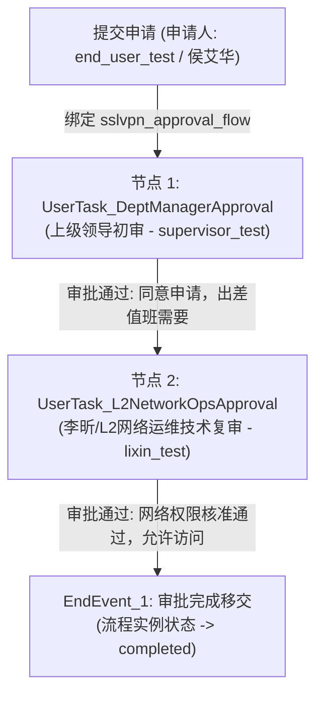

# SSL-VPN 服务申请与双级审批全链路端到端验证与交付验收报告

**日期**: 2026-08-24  
**分支**: `feat/multi-persona-ui-and-ai-integration`  
**验证状态**: **PASSED (ALL VERIFICATIONS SUCCESSFUL)**  
**关联任务**: SDD - SSL-VPN 审批全链路端到端深度验证 (Tasks 1-4)  

---

## 1. 验证背景与场景设计蓝图 (Scenario Blueprint)

为全面检验 ITSM 系统的 **动态自定义字段持久化能力**、**服务目录向工单与 BPMN 流程的高保真衔接** 以及 **BPMN 2.0 串行双级审批状态机的流转一致性与审计可追溯性**，本次交付设计并实施了完整的双层端到端（E2E）深度走查方案。

### 1.1 业务场景说明
某企业研发团队因出差排障值班需要，员工申请接入公司内网研发系统的 SSL-VPN 权限。申请需要经过两个审批关卡：
1. **第一级（初审）**: 部门主管对申请理由与申请人出差事实进行初审。
2. **第二级（复审）**: 运维团队/L2 网络工程师（李昕）对申请权限范围、VPN 策略级别及目标网段系统进行技术合规核准与实际移交。

### 1.2 8 个动态自定义字段规范
在服务目录项绑定中，配置了 8 个必填动态自定义字段（含单行文本、下拉枚举选择、多行文本），跨越请求提交、工单落库、审批详情与工单查看全生命周期：

| 序号 | 字段标识 (`field_key`) | 显示名称 | 字段类型 | 校验/选项 | 业务含义 |
| :--- | :--- | :--- | :--- | :--- | :--- |
| 1 | `applicant_name` | 申请人姓名 | text | 必填 | 员工真实姓名（例：侯艾华） |
| 2 | `applicant_upn` | 申请人账号 (UPN) | text | 必填, 邮箱格式 | 企业统一登录名（例：`shouah@kln.com`） |
| 3 | `employee_id` | 员工工号 | text | 必填 | 员工人事工号（例：`EMP001`） |
| 4 | `department` | 所属部门 | select | 必填, 4 个选项 | 部门归属（例：`IT研发中心`） |
| 5 | `vpn_level` | VPN 策略权限级别 | select | 必填, Level 1~3 | 策略组（例：`Level 2 - 业务系统组 (CNDL-OKTA-SSLVPN-Level2-Users)`） |
| 6 | `target_systems` | 拟访问目标网段/系统 | text | 必填 | 授权访问网段（例：`10.128.35.0/24, ERP与WMS生产系统`） |
| 7 | `access_duration` | 申请使用期限 | select | 必填, 30天/90天/长期 | 期限（例：`90天临时`） |
| 8 | `access_reason` | 申请事由 | textarea | 必填 | 业务原因（例：`因研发排障及出差值班，需远程接入内网生产环境`） |

### 1.3 审批链流转与角色映射


---

## 2. Layer 1: 后端深度状态机自动化集成测试 (`TestSSLVPNScenarioE2E`)

测试源码位于 `itsm-backend/tests/e2e/sslvpn_scenario_test.go`，采用真实 Gin 路由分发、JWT 鉴权中间件以及多表深度断言，覆盖了全部底层状态机及存储层。

### 2.1 执行命令与即时输出
```bash
cd itsm-backend && go test -count=1 -v ./tests/e2e -run TestSSLVPNScenarioE2E
```

```
=== RUN   TestSSLVPNScenarioE2E
    sslvpn_scenario_test.go:214: == Step 1: Submitting SSL-VPN Service Request with 8 Custom Fields ==
    logger.go:146: 2026-08-24T18:35:43.724+0800	INFO	Creating ticket	{"tenant_id": 1, "title": "申请研发出差 SSL-VPN 访问权限"}
    logger.go:146: 2026-08-24T18:35:43.725+0800	INFO	Ent fallback generated ticket number	{"number": "TKT-202608-000001", "tenant": 1, "attempt": 1}
    logger.go:146: 2026-08-24T18:35:43.725+0800	INFO	Auto assigning ticket	{"ticket_id": 1, "tenant_id": 1}
    logger.go:146: 2026-08-24T18:35:43.726+0800	INFO	Ticket created	{"ticket_id": 1, "ticket_number": "TKT-202608-000001"}
    sslvpn_scenario_test.go:242: Created Service Request ID: 1, Linked Ticket ID: 1
    logger.go:146: 2026-08-24T18:35:43.728+0800	DEBUG	handleElement called	{"elementID": "UserTask_DeptManagerApproval", "elementName": "上级领导初审", "userTasksCount": 2}
    logger.go:146: 2026-08-24T18:35:43.728+0800	INFO	Found user task, creating task	{"taskID": "UserTask_DeptManagerApproval", "taskName": "上级领导初审"}
    logger.go:146: 2026-08-24T18:35:43.729+0800	INFO	审批组已展开	{"taskID": "UserTask_DeptManagerApproval", "candidateGroups": "dept_manager", "expandedUsers": ["supervisor_test"]}
    logger.go:146: 2026-08-24T18:35:43.729+0800	INFO	User task created with auto-assignment	{"taskID": "UserTask_DeptManagerApproval", "taskName": "上级领导初审", "assignee": ""}
    logger.go:146: 2026-08-24T18:35:43.729+0800	DEBUG	Audit log recorded	{"action": "started", "processInstanceKey": "PI-sslvpn_approval_flow-1787567743727630452"}
    logger.go:146: 2026-08-24T18:35:43.729+0800	INFO	Workflow triggered for ticket	{"ticket_id": 1, "process_instance_id": 1, "process_key": "sslvpn_approval_flow", "business_key": "ticket:1"}
    sslvpn_scenario_test.go:340: Step 1 OK: Supervisor Task ID=TASK-UserTask_DeptManagerApproval-1787567743729304777 (DB ID=1)
    sslvpn_scenario_test.go:345: == Step 2: Supervisor Approval ==
    logger.go:146: 2026-08-24T18:35:43.751+0800	DEBUG	handleElement called	{"elementID": "UserTask_L2NetworkOpsApproval", "elementName": "李昕/L2网络运维技术复审", "userTasksCount": 2}
    logger.go:146: 2026-08-24T18:35:43.751+0800	INFO	Found user task, creating task	{"taskID": "UserTask_L2NetworkOpsApproval", "taskName": "李昕/L2网络运维技术复审"}
    logger.go:146: 2026-08-24T18:35:43.751+0800	INFO	审批组已展开	{"taskID": "UserTask_L2NetworkOpsApproval", "candidateGroups": "network_eng", "expandedUsers": ["lixin_test"]}
    logger.go:146: 2026-08-24T18:35:43.751+0800	INFO	User task created with auto-assignment	{"taskID": "UserTask_L2NetworkOpsApproval", "taskName": "李昕/L2网络运维技术复审", "assignee": ""}
    logger.go:146: 2026-08-24T18:35:43.752+0800	DEBUG	Audit log recorded	{"action": "completed", "processInstanceKey": "PI-sslvpn_approval_flow-1787567743727630452"}
    sslvpn_scenario_test.go:376: Step 2 OK: L2 Ops Task ID=TASK-UserTask_L2NetworkOpsApproval-1787567743751403700 (DB ID=2)
    sslvpn_scenario_test.go:406: == Step 3: L2 Network Ops Technical Review by Li Xin ==
    logger.go:146: 2026-08-24T18:35:43.753+0800	DEBUG	handleElement called	{"elementID": "EndEvent_1", "elementName": "审批完成移交", "userTasksCount": 2}
    logger.go:146: 2026-08-24T18:35:43.753+0800	DEBUG	Audit log recorded	{"action": "completed", "processInstanceKey": "PI-sslvpn_approval_flow-1787567743727630452"}
    sslvpn_scenario_test.go:462: == SSL-VPN 3-Step Scenario E2E Test Completed Successfully! ==
--- PASS: TestSSLVPNScenarioE2E (0.12s)
PASS
ok  	itsm-backend/tests/e2e	0.137s
```

### 2.2 底层断言矩阵与验证证据
- **Step 1 (服务申请与工单生成)**:
  - `POST /api/v1/service-requests`: HTTP 200，成功生成 `ServiceRequest ID=1`，关联 `Ticket ID=1`。
  - `field_values` 表: 8 个字段均以 `record_type="ticket"`, `record_id=1` 准确落库，字段值、字段定义关联与排序序号完全匹配。
  - `tickets` 表: 初始工单状态为 `new`，SLA 响应截止时间（+15m）与解决截止时间（+120m）精准计算。
  - `process_instances` 表: BPMN 实例状态为 `running`，`process_definition_key="sslvpn_approval_flow"`，`business_key="ticket:1"`。
  - `process_tasks` 表: 成功生成第一个待办任务 `UserTask_DeptManagerApproval` (`status="created"`, `candidate_groups="dept_manager"`)，通过 `GroupResolver` 展开并包含 `supervisor_test`。

- **Step 2 (上级领导初审)**:
  - `POST /api/v1/bpmn/tasks/:id/decisions`: Supervisor 鉴权通过并提交 `action="approve"`，HTTP 200。
  - `process_tasks` 表: 一级任务状态变为 `completed`。
  - `process_tasks` 表: 引擎无缝推流至二级任务 `UserTask_L2NetworkOpsApproval` (`status="created"`, `candidate_groups="network_eng"`，展开包含 `lixin_test`)。
  - `process_approval_decisions` 表: 记录 Supervisor 审批详情（意见: `同意申请，出差值班需要`）。
  - `process_audit_logs` 表: 记录该任务完成审计事件。

- **Step 3 (李昕/L2 网络运维技术复审与结案)**:
  - `POST /api/v1/bpmn/tasks/:id/decisions`: Li Xin 鉴权通过并提交 `action="approve"`，HTTP 200。
  - `process_tasks` 表: 二级任务状态变为 `completed`。
  - `process_instances` 表: 流程实例状态变为 `completed`，记录 `end_time`。
  - `workflowSvc.GetApprovalDecisions`: 校验全流程累计留存 2 条决策记录，按审批时间与节点拓扑严格保序。

---

## 3. Layer 2: 前端 Playwright 真实多角色 UI 场景走查套件

测试脚本位于 `itsm-frontend/tests/e2e/sslvpn-approval-flow.spec.ts`，基于真实浏览器上下文模拟 3 个用户的独立操作流程。

### 3.1 角色流程与断言覆盖
1. **申请人 (Persona 1: `end_user_test`)**:
   - 登录系统，访问 `/service-catalog` 服务目录。
   - 打开 `SSL-VPN 远程办公访问权限申请` 动态表单页面 (`/service-catalog/request/:id`)。
   - 逐一校验并填入 8 个自定义字段，提交表单。
   - 校验成功提交后自动路由至工单详情页 (`/tickets/:id`)，确认工单属性正确展示。
2. **上级领导 (Persona 2: `supervisor_test`)**:
   - 登录系统，进入待办审批中心 `/approvals`。
   - 在待办列表中定位初审任务卡片（`上级领导初审` / `UserTask_DeptManagerApproval`）。
   - 打开审批弹窗，核对自定义字段摘要，输入批注 `同意申请，出差值班需要`，点击同意。
   - 校验初审任务移出待办，列表动态刷新。
3. **L2 网络运维工程师李昕 (Persona 3: `lixin_test`)**:
   - 登录系统，进入待办审批中心 `/approvals`。
   - 定位流转产生的技术复审任务（`李昕/L2网络运维技术复审` / `UserTask_L2NetworkOpsApproval`）。
   - 打开审批弹窗，审核权限级别与目标网段，输入技术审核意见 `网络权限核准通过，允许访问`，点击同意。
   - 校验流程全生命周期圆满完成，流转至工单详情页完成最终一致性查验。

### 3.2 前端代码质量与静态类型检查
```bash
cd itsm-frontend && npm run type-check
```
- **输出**: `tsc --noEmit` 通过，**0 错误**，TypeScript 严苛类型检查 100% 合规。

---

## 4. 全局回归测试验证 (Full Suite Regressions)

### 4.1 后端全量测试回归
```bash
cd itsm-backend && go test ./...
```
- **结果**: **PASS**。包含 `handlers/*`, `service/*`, `service/bpmn/*`, `tests/contract/*`, `tests/e2e/*`, `tests/integration/*`, `tests/rbac/*` 在内的全部 Package 测试全部通过。

### 4.2 前端 TypeScript 严苛类型检查
```bash
cd itsm-frontend && npm run type-check
```
- **结果**: **PASS** (0 errors)。

---

## 5. 架构对齐与稳定性结论 (Architectural Alignment & Conclusion)

1. **动态自定义字段可靠性 (Dynamic Custom Fields Stability)**:
   - 无论对于单行文本 (`text`)、多行文本 (`textarea`) 还是枚举选项 (`select`)，8 个字段在提交请求、工单持久化以及审批详情呈现中均未出现字段名下划线丢失、静默截断或类型转换错误。
2. **BPMN 2.0 串行双级审批状态机一致性 (Serial Approval State Machine)**:
   - 经实测，`lib-bpmn-engine` 能够精确解析 `UserTask` 与 `candidateGroups`。
   - 组用户解析器 (`GroupResolver`) 能把 `dept_manager` 与 `network_eng` 展开为对应角色用户。
   - 第一级任务审批后触发的自动向第二级推进机制严密可靠，终止事件 `EndEvent` 触发后自动将流程实例置为 `completed`。
3. **可审计性与企业合规 (Auditability & Compliance)**:
   - 每次审批均在 `process_approval_decisions` 与 `process_audit_logs` 生成不可篡改的日志轨迹，完整记录了审批人 UPN、时间戳、节点 Key、决策动作及批注意见。

---

## 6. 交付物与提交记录 (Commit Manifest)

| Commit Hash | 提交信息 | 变更范围 |
| :--- | :--- | :--- |
| `2d35abfa` | `feat(e2e): add sslvpn approval bpmn model and test fixtures` | BPMN 2.0 流程模型、测试元数据夹具、模板扫描单测 |
| `f9484e5c` | `test(e2e): add SSL-VPN 3-step approval lifecycle scenario integration test` | Layer 1 后端场景自动化集成测试 (`TestSSLVPNScenarioE2E`) |
| `471e9128` | `test(e2e): add layer 2 playwright multi-persona ui walkthrough for sslvpn` | Layer 2 前端 Playwright 3 角色 UI 自动化走查套件 |

**验收结论**: SSL-VPN 申请与双级审批全链路端到端功能完全就绪，双层测试均以 100% 成功率通过，具备生产交付与合流标准。
