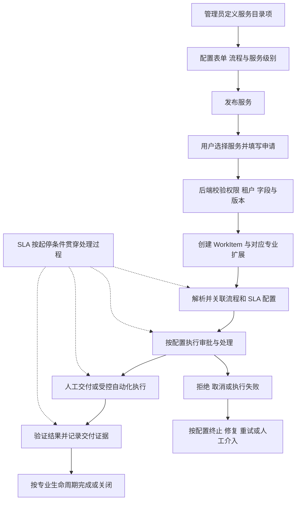

# ITSM 从服务目录到工单流程与 SLA

更新日期：2026-09-08  
适用对象：产品负责人、服务目录管理员、流程管理员和运维人员。

本文说明服务目录、工单、流程、SLA 与交付关闭之间的关系，并以 SSL-VPN 申请展示一条完整业务链路。内容基于当前代码与项目领域约定；示例中的审批层级、计时方式和完成条件需要按具体服务配置，不代表所有服务已完成端到端验收。

**服务目录定义提供什么，工单记录这一次需求，流程安排谁做什么，SLA 约束多久完成。**

这些模块围绕同一项工作协同运行。SLA 在满足计时条件时开始贯穿处理过程，不是流程结束后的独立步骤。

## 1 核心概念与职责

| 概念 | 负责什么 | 示例 |
|---|---|---|
| 目录分类 | 帮助用户浏览和查找服务 | 办公与协作、远程访问 |
| 服务目录项 | 定义可申请的服务、申请字段、目标工作项类型、流程及服务级别 | 申请 SSL-VPN |
| 工单分类 | 对工作进行业务归类，供分派、SLA、统计、知识和自动化规则使用 | 网络 → VPN → 权限开通 |
| WorkItem 基础记录 | 保存编号、标题、申请人、处理人、状态及审计等共享信息 | 某员工的一次 VPN 申请 |
| 专业扩展 | 保存服务请求、事件、问题或变更等专业领域的信息 | 服务请求的交付参数与履约信息 |
| 流程定义 | 描述审批、处理、自动化及异常分支的规则 | 主管审批后交网络运维处理 |
| 流程实例 | 记录某一次流程执行的位置、任务和历史 | 当前申请等待主管审批 |
| SLA | 约定响应及解决或交付目标，按规则监控时间 | 工作时间内响应、超时预警 |

当前实现中需要特别区分：

- `ServiceCatalog.category` 是目录项的字符串分组属性。
- `Ticket.category_id` 关联独立的 `TicketCategory` 分类树。
- 二者没有自动映射。需要自动归类时，应建立明确的配置关系，不能通过相同名称推断。
- 自定义字段归属于具体服务目录项或工单模板，目前不是按分类继承。
- `recordClass` 表示专业类别，例如服务请求、事件、问题、变更；它与工单业务分类不是同一个字段。

## 2 整体业务链路

该图表示业务关系，不规定所有内部操作的事务或调度顺序。流程是否包含审批、是否自动执行，以及是否需要申请人确认，均取决于服务配置。

## 3 先配置服务再接受申请

### 3.1 定义服务目录项

管理员在“服务目录管理”中维护服务名称、说明、目录分类和申请字段，并明确目标工作项类型。根据服务需要配置流程、交付参数及服务级别。

一个目录项表示可重复申请的服务定义。用户每提交一次申请，系统产生一次独立的工作记录，目录项本身不会变成工单。

### 3.2 设计流程与处理规则

流程管理员通过 BPMN 定义审批节点、候选处理人、执行步骤和异常分支。工单分类、处理团队及流程绑定共同支撑工作的归类与处理。

流程编排与专业领域服务各有职责：流程决定下一步执行什么；后端领域服务负责权限、租户校验、状态转换、业务条件和审计。不能让流程节点绕过领域规则直接宣告成功。

### 3.3 发布并提供申请入口

用户通过“服务目录”浏览可申请的目录项。提交时，后端需要校验身份、租户、字段以及目录和表单版本。目录发生变化后，应由申请人重新确认适用内容，避免按旧表单提交新定义的服务。

## 4 申请提交后的执行过程

### 4.1 创建统一工作记录

当目录项的目标类型是服务请求时，系统创建 WorkItem 基础记录和服务请求专业扩展。它们描述同一次申请，不是两张需要独立维护的工单。

当前前端在创建成功后跳转到 `/tickets/{workItemId}`。操作人员从工单详情查看共享信息，再通过关联的流程与专业数据了解具体执行情况。

### 4.2 关联流程和 SLA

后端解析目录专属流程或适用的流程绑定，并关联相应配置。所需流程不能因为配置缺失或目标未知而被当作已执行成功；需要明确失败、阻塞或进入可观察的人工处理状态。

目录配置中的时间值与实际计时规则需要一并检查。是否正确关联 SLA 定义、何时开始计时、哪些状态暂停，以及何时停止计时，都影响最终履约结果。

### 4.3 审批与处理

审批人通过“我的待办”处理 BPMN 任务，管理员通过“流程实例”查看当前节点及执行历史。审批通过通常意味着允许进入后续执行阶段，并不等于服务已交付。

不同服务可采用无需审批、单级审批或多级审批等配置。不要将某个示例流程的审批层级视为所有目录项的统一要求。

### 4.4 交付与验证

处理人员完成人工操作，或由受控连接器执行自动化任务。执行结果需要经过后端领域服务校验，形成可追踪的交付证据和状态更新。

调用成功、请求被接收与实际交付成功需要分别判断。例如 VPN 开通任务被执行器接收，并不能直接证明目标账号已具备可用权限。

### 4.5 完成与关闭

各专业领域拥有自己的生命周期：服务请求关注交付，事件关注恢复服务，问题关注根因，变更关注授权、实施和评审。

是否经过申请人确认、是否保留“已解决”到“已关闭”的阶段，以及何时允许重开，应遵循对应领域规则。不要强制所有专业类型共用一套状态机，也不要把流程实例结束直接等同于工单可以关闭。

## 5 SLA 如何贯穿处理过程

| 配置项 | 需要明确的问题 |
|---|---|
| 响应目标 | 什么行为算首次有效响应，要求多久发生 |
| 解决或交付目标 | 什么结果算完成，要求多久达到 |
| 开始条件 | 提交、受理、分派或其他事件中，哪个触发计时 |
| 暂停与恢复 | 等待资料、审批或外部依赖时是否暂停，何时恢复 |
| 服务日历 | 按自然时间还是工作时间计算，如何处理节假日 |
| 停止条件 | 已交付、已解决、关闭或取消如何处理计时 |
| 预警与升级 | 临近超时和实际超时分别通知谁，是否升级处理 |

仅在目录中填写响应时间和解决时间，不足以证明上述规则全部生效。每个重点服务都应通过实际申请验证 SLA 关联、计时变化、预警及完成后的停止行为。

## 6 SSL VPN 申请示例

以下是可用作样板的业务流程，具体审批人和规则以已发布配置为准。

1. 用户在服务目录中选择“申请 SSL-VPN”，填写申请理由、有效期等字段。
2. 后端校验申请，并创建服务请求对应的 WorkItem 与专业扩展。
3. 系统根据明确配置确定工单分类、处理团队、流程及 SLA。
4. 主管通过“我的待办”审批。若配置要求，再进入网络运维审批。
5. 审批通过后，由处理人员或执行器开通权限；拒绝或取消进入对应分支。
6. 验证目标权限和交付结果，记录证据；失败时按规则重试或转人工处理。
7. 满足服务请求的完成条件后更新状态，并按规则停止计时及完成关闭。

建议先将这个服务跑通，再复用配置方法建设其他服务。复用的是配置方法和可复用流程能力，不应直接复制固定审批人或未经确认的时间阈值。

## 7 页面入口

以下链接适用于当前本机 3001 环境；部署到其他环境后需替换域名和端口。

| 页面 | 用途 | 本机入口 |
|---|---|---|
| 服务目录 | 浏览服务并发起申请 | [打开服务目录](http://localhost:3001/service-catalog) |
| 服务目录管理 | 维护目录项、申请字段及相关配置 | [打开目录管理](http://localhost:3001/admin/service-catalogs) |
| 工单分类 | 维护业务分类树 | [打开分类管理](http://localhost:3001/admin/ticket-categories) |
| 工作流管理 | 管理流程定义和绑定入口 | [打开工作流管理](http://localhost:3001/admin/workflows) |
| 流程设计器 | 设计 BPMN 流程 | [打开设计器](http://localhost:3001/workflow/designer) |
| 流程实例 | 跟踪每次流程执行 | [打开流程实例](http://localhost:3001/workflow/instances) |
| 我的待办 | 处理审批及流程任务 | [打开审批中心](http://localhost:3001/approvals) |
| SLA 配置 | 管理服务级别定义 | [打开 SLA 配置](http://localhost:3001/admin/sla-definitions) |
| SLA 监控 | 查看履约情况 | [打开 SLA 监控](http://localhost:3001/sla-dashboard) |

菜单可见性仍受角色和权限约束；隐藏菜单不能代替后端授权。

## 8 样板服务配置与验收清单

- [ ] 明确服务目录项的名称、说明和目录分类。
- [ ] 明确目标工作项类型及对应专业生命周期。
- [ ] 明确申请字段、必填规则和版本变更后的确认方式。
- [ ] 明确工单分类的来源，不依赖目录分类名称猜测。
- [ ] 明确处理团队、审批候选人和分派规则。
- [ ] 明确流程绑定、审批分支及无需审批时的行为。
- [ ] 明确人工或自动交付方式及所需权限。
- [ ] 明确交付成功的证据、失败处理和重试规则。
- [ ] 明确 SLA 的开始、暂停、恢复、停止及服务日历。
- [ ] 明确预警和升级对象。
- [ ] 明确完成、关闭、取消和重开的条件。
- [ ] 用正常申请、拒绝或取消、执行失败及超时场景完成验收。
- [ ] 核对整个过程的租户隔离、权限、审计与持久化结果。

## 9 相关设计与源码

本文解释业务链路，不替代下列权威约定与实现：

- [WorkItem 领域契约](../../AGENTS.md#unified-work-item-domain-contract)
- [开发与运维手册](../DEVELOPMENT_GUIDE.md)
- [服务目录模型](../../itsm-backend/ent/schema/servicecatalog.go)
- [工单分类模型](../../itsm-backend/ent/schema/ticketcategory.go)
- [自定义字段定义](../../itsm-backend/ent/schema/field_definition.go)
- [服务申请提交页面](../../itsm-frontend/src/app/%28main%29/service-catalog/request/%5Bid%5D/page.tsx)
- [服务请求创建逻辑](../../itsm-backend/handlers/service_request/creation.go)
- [服务请求流程回调](../../itsm-backend/handlers/service_request/workflow_callback.go)
