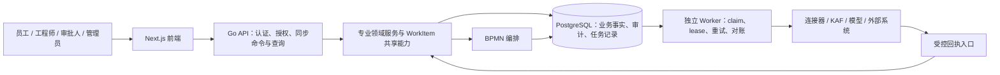

# ITSM 架构、功能差距与迭代建议报告

> 状态：draft — 待用户 Review，尚未进入讨论或实施阶段。
>
> 评估日期：2026-09-05。
>
> 代码基线：`5b2dd2c62358fd6e7f07d1886a2c67f750d8422f`。
>
> 本文整理自本次会话中的架构分析，保留代码依据、建议优先级与验证边界。它是评审材料，不是已批准的架构决策、实施计划或发布批准。

## 评估摘要

**ITSM 已具备较完整的企业服务管理骨架，正在从“功能覆盖”进入“跨域一致性与生产可靠性”阶段。当前最有价值的投入，是完成统一创建边界、可靠异步执行、知识权限过滤与真实场景验收。模块化单体继续作为核心，独立 Worker 承担耗时和外部副作用，符合现阶段的业务耦合与部署目标。**

本次以仓库实际存在的 [AGENTS.md](../../AGENTS.md) 为架构约束，结合 8 月以来的设计、评估和验收文档，直接核查关键实现。报告中的证据分类如下：

- **已确认**：当前代码存在的行为或缺口。
- **待验证**：存在风险，但尚无本次运行证据证明实际影响。
- **建议**：后续设计与验收目标，不代表已经实现。

本次未执行生产环境操作、完整浏览器验收或容量压测，因此不提供功能完成百分比，也不推断系统可承载的并发量。

## 一、评估依据与现状校正

### 1.1 主要文档依据

| 文档 | 本次使用方式 |
| --- | --- |
| [AGENTS.md](../../AGENTS.md) | 产品方向、领域模型、安全、租户与执行边界的权威约束 |
| [Coding Agent 工程协作规范](../agent-engineering-governance.md) | 文档、分支、迁移、并行协作与验收纪律 |
| [2026-08-26 Unified WorkItem 设计](../superpowers/specs/2026-08-26-unified-work-item-model-design.md) | 统一身份与专业域职责的设计来源 |
| [2026-08-30 架构评估](../architecture-product-assessment-2026-08-30.md) | 历史问题基线，结论需对照当前代码重新核查 |
| [2026-09-01 架构评估](../architecture-product-assessment-2026-09-01.md) | 对照其后代码变化，避免复述过期缺陷 |
| [2026-09-02 Unified Intake 归并设计](../superpowers/specs/2026-09-02-unified-intake-workitem-creator-remediation-design.md) | 创建入口收口、专业 Creator 与待归并边界 |
| [2026-09-02 Unified Intake 归并计划](../superpowers/plans/2026-09-02-unified-intake-p1-reconciliation.md) | 归并顺序、字段映射与迁移冲突处理 |
| [2026-09-03 模块化单体与 Worker 平台设计](../superpowers/specs/2026-09-03-modular-monolith-worker-platform-design.md) | 已有演进方向，状态为 Approved for planning |
| [2026-09-03 SSLVPN/KAF 验收报告](../reports/2026-09-03-sslvpn-kaf-worker-production-readiness-report.md) | 区分本地验证与剩余生产准入门禁 |

文档状态、其他分支实现和当前代码交付状态分别判断；不把规划直接视为能力完成。

### 1.2 旧报告中的部分结论已经过期

8 月底至 9 月初变化较快。直接沿用旧评估，会把已完成的工作重新列为缺陷。

| 主题 | 当前核查结论 | 对规划的影响 |
| --- | --- | --- |
| WorkItem 共享字段 | Incident 创建已在事务内建立 Ticket 基表与专业扩展，共享状态通过 WorkItem 更新 | 不再把 Incident 标题、状态双写作为原样待办；重点转向创建入口与 SLA 一致性 |
| 工单编号 | 已有统一 `workitemnumber.Allocator`，Incident 创建已调用 | 不再另建编号服务；后续 Intake 必须复用 |
| Ticket 审批 | 当前 `ticket_workflow_service.go` 已无旧 `TicketApproval` 写路径；9 月 2 日设计记录审批单轨化已合入 | 应验证审批闭环，不能继续建议“重新删除双轨审批” |
| BPMN 未注册任务 | 当前引擎对未注册处理器返回明确错误 | 通用 NoOp 缺陷已修正，后续重点是各分发面的统一执行 |
| Outbox | 已覆盖 KAF、Incident 告警等路径，另有 BPMN callback 持久化机制 | 不再是“完全没有 Outbox”；问题是覆盖范围与运行模型尚未统一 |
| KAF Worker | 已有独立命令，API 不再承担 KAF 投递职责 | Worker 隔离已迈出实质一步 |
| Unified Intake | 当前 checkout 中尚无 `handlers/intake`；归并设计仍为 planning 状态 | 不能把其他分支的实现当作当前已交付能力 |
| 生产准入 | 最新 SSLVPN/KAF 验收报告仍为 **Conditional No-Go** | 代码和静态部署校验通过，不等于真实外部变更链路已验收 |

代码依据：[Incident 创建](../../itsm-backend/service/incident_service.go)（基线约第 175 行）、[BPMN 引擎](../../itsm-backend/service/bpmn_process_engine.go)（约第 1120 行）、[Ticket 流转服务](../../itsm-backend/service/ticket_workflow_service.go)、[Incident 告警 Outbox](../../itsm-backend/service/incident_alerting_service.go)、[KAF Worker](../../itsm-backend/cmd/kaf_worker/main.go)。文中行号仅对应上述基线，后续以符号名定位。

## 二、系统架构与技术评估

### 2.1 架构优势

| 优势 | 当前基础 | 实际价值 |
| --- | --- | --- |
| 后端业务事实源明确 | Go/Gin 后端拥有状态机、权限、租户、流程和审计 | 前端、连接器与 Agent 可围绕统一规则扩展 |
| 共享模型兼顾专业领域 | WorkItem 统一身份与公共字段，Incident、Problem、Change 保留专业生命周期 | 有利于统一工作台、关联分析和审计，同时避免专业流程被简单化 |
| 事务边界适合当前业务 | PostgreSQL/Ent 支撑基表与扩展原子创建 | 私有部署简单，跨域一致性成本可控 |
| BPMN 编排能力持续收敛 | 审批、任务、回调、持久化恢复与授权逐步集中 | 具备支撑复杂履约流程的基础 |
| KAF 已形成可靠执行范例 | 独立 Worker、租约、回执、幂等、未知投递状态 | 可作为其他外部副作用执行的参考 |
| 工程治理约束清楚 | 架构契约、迁移纪律、独立审查与验证证据要求 | 有利于控制多 Coding Agent 并行开发的语义冲突 |

**架构路线建议：继续落实 9 月 3 日的模块化单体与 Worker 设计。** 核心业务仍共享数据库和领域服务，通过独立进程角色隔离执行负载，暂不需要引入更多服务间 RPC 和分布式事务。

下图表示建议的目标职责边界，不能据此认为通用 Worker、Delivery 或 Job 平台已经全部交付：



### 2.2 主要瓶颈与隐患

#### A. 创建入口尚未统一，领域正确性仍存在明确缺口

**已确认：** Service Request 创建路径根据 Catalog 的 `targetClass` 映射 Ticket 类型，随后构造 `ServiceRequest` 扩展。结合归并设计对 Change 路径的核查，目录派生 Change 尚未形成真实 Change 专业扩展。[创建代码](../../itsm-backend/handlers/service_request/service.go)（约第 166 行）

Catalog Repository 仍通过 `ComputeTargetClass(catalog.ITSMType)` 推导目标类，说明 `targetClass` 尚未成为完全独立的权威配置。[目录写入](../../itsm-backend/handlers/service_catalog/repository_impl.go)（约第 23 行）

**为什么必须优先处理：** 用户认为自己提交了“变更申请”，系统底层却可能进入 Service Request 生命周期，导致 CAB、风险、实施、回滚和 PIR 无法依靠真实 Change 模型闭环。

**怎么做：**

1. 按现有 Unified Intake 设计完成归并，复用统一编号器。
2. 通过 Creator Registry 调用专业域创建规则；专业状态机仍由专业 Service 所有。
3. 同事务完成 WorkItem、专业扩展、动态字段、审计和必要的流程启动记录。
4. 枚举 HTTP、Catalog、BPMN、邮件、AI 等所有创建入口，逐一验收。
5. Catalog 发布时校验目标类、流程、表单、SLA 与履约能力组合。

#### B. RLS 的观测接线与数据库强制隔离仍有距离

**已确认：** 数据库初始化的 RLS 包装器明确不负责设置租户会话变量；此次检索没有找到 `AcquireConn` 的生产调用点，默认模式为 `off`。[数据库说明](../../itsm-backend/database/database.go)（约第 110 行）、[连接辅助实现](../../itsm-backend/database/rls/rls.go)（约第 66 行）

这说明数据库级防线尚未形成完整证据链，**不能据此直接断言已经发生跨租户泄露**；应用层租户过滤仍需逐路径判断。

**优化策略：**

- 在统一事务/连接执行边界设置租户上下文，确保 Ent 与原生 SQL 使用同一受约束连接。
- 优先考虑事务内 `SET LOCAL`；若使用 session 状态，必须验证连接复用、错误退出和清理。
- 区分普通租户、MSP 授权访问、系统任务三类执行身份。
- 使用实际运行账号验证策略，覆盖无租户、跨租户、连接池复用和后台任务。

PostgreSQL 的表所有者通常绕过 RLS，超级用户与 `BYPASSRLS` 角色也需要单独考虑，所以“策略已创建”不能替代运行角色验收。[PostgreSQL 官方说明](https://www.postgresql.org/docs/17/ddl-rowsecurity.html)

#### C. AI 工具队列存在静默丢任务行为

**已确认：** `ToolQueue` 使用内存 channel；`Enqueue` 在队列满时进入空 `default`，不返回错误，也不记录丢弃。API bootstrap 当前会构造该队列。[队列实现](../../itsm-backend/service/tool_queue.go)（约第 21 行）、[AI 审批调用](../../itsm-backend/handlers/ai/service.go)（约第 212 行）

**用户影响：** 高峰期批准的操作可能没有执行反馈；进程重启后，内存中的排队记录无法承担可靠恢复职责。

**怎么做：**

- 以持久化 Job 记录作为唯一排队事实。
- 审批与 Job 状态更新保持事务一致。
- Worker 通过 claim、lease 和条件更新执行。
- 明确区分待执行、执行中、成功、失败、阻塞、结果未知。
- 对超时但外部结果未知的操作先对账，避免直接重试。

Outbox/持久化队列仍可能重复投递，消费端必须保证幂等，不能把它理解为自动获得 exactly-once。[AWS 官方模式说明](https://docs.aws.amazon.com/en_en/prescriptive-guidance/latest/cloud-design-patterns/transactional-outbox.html)

#### D. 后台任务与 API 仍有较强资源耦合

**已确认：** SLA、升级、Embedding 仍在 API bootstrap 中通过 goroutine/ticker 执行；部分循环使用 `context.Background()`，没有跟随应用生命周期退出。Embedding 枚举租户失败时还会回退到固定租户 `1`。[后台任务代码](../../itsm-backend/internal/bootstrap/app.go)（约第 1226 行）

**风险：**

- API 扩副本会同时增加后台扫描者。
- SLA 扫描与 Embedding 争用数据库和外部模型资源。
- 退出与重启时难以准确界定任务归属。
- 固定租户 fallback 不符合配置驱动和明确失败的契约。

**建议：** 按 SLA → Embedding → 通用连接器/导出 → AI Tool 的顺序迁移。每种任务上线 Worker 时，同批删除 API 执行路径，并补齐限流、租户配额、积压指标与故障恢复测试。AI Tool 静默丢任务的 P0 修复不应等待整个平台迁移完成；其持久化设计应服从同一执行契约。

这里需要区分：**多副本重复扫描风险已存在，但是否产生重复通知或重复升级，仍需逐消费路径验证其幂等措施。**

#### E. 知识检索缺少完整的发布状态与可见性过滤

**已确认：**

- 关键词检索条件包含租户与未删除条件，但未检查 `is_published`、`review_status`。
- 向量结果在查不到有效文章元数据时，仍可能保留原向量 snippet 返回。
- 知识模型实际存在发布与审核状态字段。

依据：[检索实现](../../itsm-backend/service/rag_service.go)（约第 160 行）、[知识模型](../../itsm-backend/ent/schema/knowledgearticle.go)（约第 14 行）。

**影响：** 草稿、下架或陈旧向量内容可能进入 RAG 候选集。具体哪些角色能触达，需要补接口级权限验收。

**怎么做：**

1. 建立统一的知识可见性查询规则，覆盖 tenant、actor、发布状态、删除状态和版本。
2. 检索前限制候选集，进入模型上下文前再次校验。
3. 发布、下架和删除驱动持久化索引更新。
4. 检索结果关联有效文档版本，失效结果直接剔除。
5. 用“同租户不同角色＋草稿＋下架＋残留向量”构建回归矩阵。

#### F. 模块边界约束尚未充分转化为代码护栏

当前基线实测，BPMN 核心引擎约 **4,488 行**，路由约 **1,708 行**，CMDB Controller 约 **1,879 行**。文件规模本身不是缺陷，但结合 legacy Controller/Service 与 vertical slice 并存，会增加修改和审查成本。

另外，`WithdrawTicket` 的状态更新与流转记录是两个步骤，更新也未采用接单路径已有的版本条件，存在并发覆盖或审计不一致的风险。[工单流转服务](../../itsm-backend/service/ticket_workflow_service.go)（约第 117 行）

**建议：**

- 按完整业务命令拆分职责，避免仅按行数移动代码。
- 为关键状态迁移统一事务、对象授权、版本条件和审计。
- 添加依赖检查，阻止 Handler 直接承担持久化与跨域 Repository 调用。
- 将 schema、bootstrap、router、BPMN 核心列为并行开发中的串行集成面。

### 2.3 性能与高并发的优化顺序

目前没有容量基线，不宜仅凭 Go、Redis 或 pgvector 的存在判断可扩展性。

| 顺序 | 建议 | 为什么做 | 验证指标 |
| --- | --- | --- | --- |
| 1 | 建立核心命令、SQL 和 Worker 指标 | 识别实际瓶颈 | p95/p99、错误率、锁等待、队列年龄 |
| 2 | 完成 API/Worker 资源隔离 | 降低后台负载对交互请求的影响 | 混合负载下 API 延迟变化 |
| 3 | 优化列表、搜索与报表查询 | 大列表和宽查询易放大数据库负载 | 执行计划、扫描行数、查询耗时 |
| 4 | 引入带租户与权限范围的缓存 | 加速目录、配置和重复查询 | 命中率、失效延迟、越权负例 |
| 5 | 按证据引入读模型或物化视图 | 改善复杂统计 | 数据新鲜度与查询成本 |

审批可操作性、任务执行权和专业状态迁移仍由后端实时裁定；缓存键至少包含租户及必要的权限版本，租户切换时清理前端查询缓存。

## 三、功能缺陷与体验洞察

### 3.1 按用户角色分析关键链路

| 角色与场景 | 当前能力/事实 | GAP 与影响 | 建议与验收 |
| --- | --- | --- | --- |
| 员工：搜索知识、申请服务 | 门户有真实目录与请求查询 | 搜索组件按关键词拼固定目录 ID，并将缺失评分填成 `0.88` | 使用后端返回的租户可见目录；无评分时不显示置信度 |
| 员工：搜索后跳转 | 有防抖搜索 | 请求没有取消或序号保护，旧响应可能覆盖新结果；失败主要写 console | 增加过期响应保护、可见错误和重试 |
| 员工：申请变更 | Catalog 可表达目标类 | Change 创建与专业扩展不一致 | 验收 Catalog → Change → CAB → 实施 → PIR 的真实链路 |
| 工程师：处理与撤回工单 | 多种工作流动作已存在 | 不同动作的事务和并发保护不一致 | 并发撤回/接单只允许合法结果；状态与审计原子提交 |
| 审批人：审批后自动履约 | BPMN、KAF 和回执基础较完善 | 外部结果未知时，需要清晰的人工处理体验 | 显示阻塞原因、处理人、对账证据和允许操作 |
| 知识管理员：发布与下架 | 有审核状态与向量检索 | 检索与生命周期过滤不完整 | 下架后关键词、向量及 LLM 上下文均不可再见 |
| 平台管理员：运行自动化 | KAF 已拆 Worker | AI Tool 仍有内存队列；通用恢复机制不一致 | 统一任务查询、告警、对账和带原因的重放入口 |
| MSP 管理员：跨客户服务 | 有租户/MSP 基础 | 数据库强制边界与多角色实测证据不足 | 验证跨租户关联、检索、下载、后台执行和审计 |

门户的固定目录推荐、默认分数及异步处理见 [HeroSearchBar](../../itsm-frontend/src/components/portal/HeroSearchBar.tsx)（约第 35 行）。这些是当前代码事实，尚未通过本次浏览器测试评估其视觉表现。

### 3.2 功能覆盖度判断

| 领域 | 判断 | 下一阶段应证明的业务结果 |
| --- | --- | --- |
| Ticket / WorkItem | 基础较强，共享模型已明显收敛 | 各入口创建一致，各动作权限、审计和并发一致 |
| Incident | 专业流程与基表关联已存在 | SLA 绑定、升级、恢复服务、关闭形成一致证据链 |
| Problem / Known Error | 已有专业域基础 | Incident → Problem → Known Error 的关联、权限和知识可见性闭环 |
| Change / CAB | 专业域与 BPMN 基础较好 | Catalog 创建也必须进入真实 Change 流程 |
| Catalog / Service Request | 表单、请求、审批和履约基础较丰富 | 配置发布前能发现不可执行组合 |
| SLA | 有监控与升级机制 | 跨专业类的策略绑定、暂停/恢复、时间戳和多副本执行正确 |
| CMDB | 有 CI、关系、拓扑、影响分析基础 | 发现来源、幂等对账、关系准确性与变更影响一致 |
| Knowledge / RAG | 已具备检索和回答能力 | 内容权限、发布版本、引用和下架同步正确 |
| AI / Agent | KAF 单场景可靠性有实质进展 | 扩展场景前完成真实外部系统、失败恢复和权限验收 |
| Release / MSP 深层运营 | 本次证据不足 | 单独建立发布闭环及客户边界验收，不根据菜单或 roadmap 判断完成 |

**核心差距集中在模块连接处：** 创建入口与专业模型、状态迁移与审计、知识发布与检索、审批与异步执行、代码验收与生产部署。

## 四、复杂多 Agent 协作评估

应区分运行时业务 Agent 与开发时 Coding Agent。

### 4.1 运行时业务 Agent

KAF 已有任务范围委派、租约和回执基础，后续扩展建议沿现有契约增加：

- **写冲突控制**：专业动作携带 `expectedVersion`，旧执行者不能覆盖新状态。
- **执行预算**：按租户、任务和能力限制并发、调用次数、耗时与成本。
- **接管机制**：人工接管后撤销旧 Agent 执行权，晚到回执仍须重新校验。
- **不确定结果治理**：外部调用超时先查询目标状态，不能由另一 Agent 直接重复执行。
- **任务级追踪**：关联 WorkItem、BPMN task、Agent run、tool invocation 和外部回执。
- **数据可见性**：Agent 共享上下文遵循对象权限，不能只校验 tenant。

### 4.2 开发时 Coding Agent

9 月 2 日归并设计已经记录了两条创建方案和编号实现的冲突。说明风险不只是文本 merge conflict，还包括**接口可编译但业务语义不一致**。

建议每个架构任务维护“权威设计、目标基线、影响契约、负责人与验收矩阵”；对高冲突文件明确集成顺序，以完整业务场景验证合并结果，而不是仅检查各分支测试是否通过。

## 五、后续迭代路线图

以下 P0/P1/P2 表示**交付优先级**，不等同于已确认安全漏洞等级。各项均为待评审建议。

### 5.1 P0：核心正确性与发布门禁

| 优先项 | 为什么做 | 怎么做 | 完成标准 |
| --- | --- | --- | --- |
| P0-1 知识检索可见性 | 避免未发布或失效内容进入回答 | 统一检索过滤、版本关联与模型前校验 | 草稿、下架、无权限、残留向量负例通过 |
| P0-2 AI 队列可靠性 | 消除满载静默丢任务 | 持久化 Job、明确接收结果、恢复执行 | 满载、重启、重复审批后任务可追踪且不重复副作用 |
| P0-3 Intake 与 Catalog Change 收口 | 修复专业模型错误与创建差异 | 按归并清单整合 Creator、编号、动态字段、SLA 和流程启动 | Catalog Change 生成真实 Change；所有入口契约测试通过 |
| P0-4 租户与数据库角色验收 | 建立数据库级防线 | 连接/事务上下文接线、实际角色负例测试 | 无租户和跨租户拒绝，连接复用不残留上下文 |
| P0-5 关键动作事务与并发 | 防止状态和审计分离 | 优先修撤回、转派等动作的事务、授权和 CAS | 并发操作无非法覆盖，审计失败时业务写入回滚 |
| P0-6 SSLVPN/KAF 发布证据闭环 | 当前报告仍为 No-Go | 两 Worker、数据库角色、KAF 网关、真实 Graph 变更与清理演练 | 所有剩余准入门禁有实测记录 |
| P0-7 门户推荐真实性 | 避免错误目录和虚假置信度 | 删除固定 ID、默认评分，完善搜索错误和竞态处理 | 推荐可访问且属于当前租户，无评分不伪造 |

### 5.2 P1：可靠平台化与高价值智能化

| 优先项 | 为什么做 | 怎么做 | 主要验收 |
| --- | --- | --- | --- |
| 通用 Worker 平台 | 将 KAF 的可靠性扩展到其他任务 | 落实 Event、Delivery、Job 职责；逐任务替换旧执行路径 | 重启恢复、租约回收、重放审计、未知结果对账 |
| SLA 全域闭环 | 统一业务承诺与实际计时 | 统一创建时策略绑定，完善暂停、恢复和升级 | Ticket 与专业域 SLA 表现一致 |
| Catalog 发布前校验 | 把运行时失败前移 | 校验目标类、必填字段、流程、审批组织、SLA、能力 | 错误配置无法发布，错误可定位 |
| AI 评测与反馈 | 证明智能化实际价值 | 脱敏评测集、模型/提示版本、人工采纳与纠错记录 | 分类准确率、引用有效率、转人工率、成本可比较 |
| 企业连接器闭环 | 支撑中国企业实际工作入口 | 优先选一个真实渠道，复用身份、权限、回调和幂等边界 | 收消息→建单→审批→履约→回执完整通过 |
| CMDB 发现与对账 | 提升影响分析可信度 | 来源标识、幂等导入、冲突策略、差异预览 | 重复发现不重复建 CI，关系变化可追溯 |
| 操作工作台与接管体验 | 降低自动化失败后的人工成本 | 汇总阻塞、失败、未知、待接管任务 | 处理者能定位原因并完成恢复 |
| 架构与容量门禁 | 控制持续演进成本 | 依赖检查、关键路径压测、数据库与队列指标 | 每次迭代有可比较的性能和可靠性基线 |

### 5.3 P2：受控自治与扩展能力

| 方向 | 建议范围 | 启动前提 |
| --- | --- | --- |
| 自主决策 Agent | 从低风险、可验证、可补救任务开始；逐级扩大授权 | P0 完成，工具可靠性与 AI 评测具备证据 |
| 多 Agent 协作 | 调查、知识检索、影响分析分工，统一领域命令落地 | 版本控制、预算、接管与追踪已具备 |
| 多模态受理 | 截图、日志、语音辅助生成结构化草稿 | 脱敏、附件权限、来源追踪和用户确认完善 |
| 变更风险辅助预测 | 结合 CI 拓扑、历史失败和发布窗口提供建议 | CMDB 与 Change 数据质量达到可评测水平 |
| Skill / Plugin 生态 | 声明能力、版本、权限、配置与审计 | 通用执行契约、隔离与撤销机制成熟 |
| MSP 深层运营与多地域 | 客户级配额、计量、恢复能力和部署隔离 | 有真实客户需求及容量、恢复目标驱动 |

### 5.4 建议的依赖顺序

```text
发布门禁、知识可见性、队列可靠性
                  ↓
统一创建边界与专业模型正确性
                  ↓
通用 Worker、全域 SLA、可观测性与人工接管
                  ↓
企业连接器、可量化 AI、更多受控自动化
                  ↓
自主 Agent、多模态与生态扩展
```

实施时先为每一项明确负责人、受影响入口和验收用例，再估算工期。数据库迁移、bootstrap、路由与 BPMN 核心应由明确 owner 串行集成。

## 六、验证范围与交付判断

### 6.1 本次分析已执行的验证

在原分析阶段、上述代码基线上执行：

```bash
cd itsm-backend
go test ./database/rls ./repository/workitemnumber ./internal/workerhealth -count=1
```

结果：

```text
ok  itsm-backend/database/rls             0.003s
ok  itsm-backend/repository/workitemnumber 0.094s
ok  itsm-backend/internal/workerhealth    0.005s
```

这些结果仅证明所选包的默认测试通过；**不包含真实 PostgreSQL RLS、数据库并发集成、完整前端或生产 KAF 验收**。本文档整理阶段不把此前测试冒充为重新执行的测试。

### 6.2 尚未覆盖的验证

- 真实 PostgreSQL 运行角色下的 RLS、事务与连接池复用。
- 全量后端测试、前端类型检查、构建与浏览器验收。
- 多 API、多 Worker 的混合负载与故障注入测试。
- KAF 外部仓库的当前代码、部署状态与真实 Graph 变更演练。
- CMDB、Release、MSP 深层运营的逐角色完整业务验收。
- 全量依赖安全审计与可量化容量基线。

### 6.3 文档治理缺口

[根 Roadmap](../../ROADMAP.md) 与 [docs Roadmap](../roadmap.md) 均仍标注最后同步于 6 月 28 日，已无法准确表达 8—9 月的交付状态。

建议保留一个权威进度入口，每个能力分别记录“设计批准、代码合入、运行验收、生产准入”，并链接对应证据，避免再次将规划、分支实现与生产能力混为一谈。本文不修改现有 roadmap 或架构契约，待 Review 后讨论。

## 七、Review 状态

当前状态：**等待用户 Review。**

本文中的优先级、演进建议和验收目标均尚未获得实施批准。用户 Review 后，再围绕事实订正、优先级调整、范围边界与实施依赖展开讨论。
