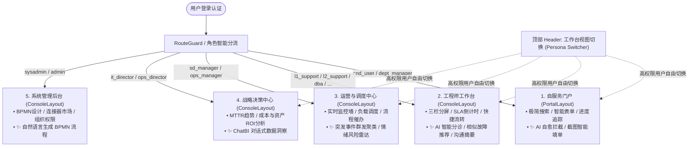

# 现代化 AI-Native ITSM 角色分层 UI 与 AI 赋能架构设计规范

- **文档版本**：v1.1 (Grill-Reviewed)
- **创建日期**：2026-08-20
- **状态**：已定稿待实施 (Approved)
- **参考标杆**：ServiceDesk Plus, Freshservice, ServiceNow

---

## 1. 背景与核心问题

当前系统的后端已具备丰富的 ITIL 流程模型、BPMN 引擎、向量检索与 20 个角色体系（`end_user`, `l1_support`, `sd_manager`, `it_director` 等），但前端 UI 目前存在以下核心痛点：

1. **“千人一面”的标准管理后台**：
   - 终端用户（7000+ 企业普通员工）登录后直面几十个复杂的 ITIL 专业菜单（CMDB、已知错误、发布计划、SLA 矩阵），无法快速找到提单入口，使用门槛高。
2. **缺乏高密度的工程师作业工作台**：
   - 一线/二线工程师（L1/L2）需要分屏处理、查看实时 SLA 倒计时、查阅上下文与知识库辅助，当前平铺表格交互效率较低。
3. **管理层与团队主管缺乏态势感知大屏**：
   - 服务台主管缺少团队负载实时看板与卡壳工单催办中心；IT 高管缺乏宏观的 MTTR、SLA、成本分析大屏。
4. **AI 能力未嵌入业务流**：
   - 现存的 RAG、向量相似度检索、BPMN 生成等后端能力较为分散，未作为“副驾驶（Copilot）”按角色和页面场景有机集成。

---

## 2. 总体架构设计

系统设计遵循 **“基于角色的视图分流 (Persona-based Layouts)”**、**“跨角色无缝切换 (Persona Switcher)”** 与 **“AI 场景化内嵌 (Embedded AI Copilot)”** 三大核心原则。



---

## 3. 角色分层 UI 详细设计

### 3.1 终端用户自服务门户 (End User Self-Service Portal)
- **目标受众**：`end_user`, `dept_manager`, `team_lead`, `guest`
- **默认路由**：`/portal`
- **布局风格**：`PortalLayout`（宽屏响应式、无侧边栏、顶部简洁轻量导航）。

#### 页面核心模块：
1. **全局大搜索框 (Hero Search)**：
   - 居中放置，提供自然语言搜索，即时展示知识库自愈方案及服务目录申请项。
2. **服务目录卡片区 (Service Catalog)**：
   - 场景化卡片（如“申请 Copilot 许可证”、“申请 VPN 权限”、“报修硬件设备”），支持表单快速填写与历史信息代填。
3. **我的请求时间轴 (My Requests Timeline)**：
   - 物流进度条式呈现（`已提交` ➔ `主管审批中 (张三经理)` ➔ `IT 配置中` ➔ `已完成`），屏蔽底层 BPMN 引擎内部状态机细节。
4. **主管待办卡片 (Pending Approvals)**：
   - 若当前用户具有审批人身份（`dept_manager` / `team_lead`），首页首屏置顶渲染审批卡片，支持一键审批/驳回。

---

### 3.2 工程师协同工作台 (Agent Workspace)
- **目标受众**：`l1_support`, `l2_support`, `l3_expert`, `ops_engineer`, `dba`, `network_eng` 等
- **默认路由**：`/workspace/tickets`
- **布局风格**：`ConsoleLayout`（紧凑型侧边栏 + 三栏分屏工单处理视图）。

#### 页面核心模块：
1. **左栏：工单队列与过滤器 (Queue View)**：
   - 预置快捷视图：`分给我的 (8)`、`服务台未分配池 (12)`、`即将 SLA 超时 (<30m)`、`待用户补充信息`。
2. **中栏：工单沟通与处理流 (Activity Stream)**：
   - 区分对外公开回复（Public Reply）与对内技术协作备注（Internal Note）。
   - 预置常用回复模板（Canned Responses）与富文本工具。
3. **右栏：上下文辅助面板 (Context & Tool Panel)**：
   - **SLA 动态倒计时钟**（绿色正常 ➔ 黄色预警 ➔ 红色违规呼吸灯）。
   - **申请人 360° 画像**：部门、直线经理、历史提单记录、名下 CI 资产（如电脑型号、IP、OS）。
   - **快捷流转**：一键转派二线团队、一键关联问题/变更。

---

### 3.3 服务台主管运营中心 (Service Desk Manager Hub)
- **目标受众**：`sd_manager`, `ops_manager`
- **默认路由**：`/manager/live-board`
- **布局风格**：`ConsoleLayout`（运营监控卡片网格）。

#### 页面核心模块：
1. **实时运营监控大屏 (Live Operations Wallboard)**：
   - 今日进单/结单比、首次解决率（FCR）、当前 SLA 达标率、P0/P1 重大事件横幅置顶。
2. **团队工作负载与派单台 (Team Workload Dispatcher)**：
   - 成员负载卡片（显示成员当前 `Active Tickets` 数量与忙闲状态）。
   - 支持将未分配公共池中的工单直接拖拽或一键自动分配给最闲技术员。
3. **审批流滞留监控与催办雷达**：
   - 监控滞留超过 48 小时的节点，主管支持一键催办或超级管理员介入流转。
4. **低分工单质检回访池**：
   - 抓取 1~2 星评价工单，供主管进行复核与用户回访。

---

### 3.4 管理层与系统管理中心 (Executive & Admin)
- **目标受众**：`it_director`, `ops_director`, `sysadmin`, `admin`
- **默认路由**：`/executive/dashboard` (管理层) 或 `/admin/overview` (管理员)

#### 页面核心模块：
1. **CIO 战略驾驶舱 (Executive Dashboard)**：
   - 季度平均恢复时间 (MTTR) 下降趋势、部门 IT 资源消耗排行（如 Copilot 许可证分布）、业务系统可用率报表。
2. **系统底座管理 (System Admin)**：
   - BPMN 流程设计器、连接器市场（Connector Marketplace）、SLA 升级矩阵、企业组织与 RBAC 权限。

---

## 4. 场景化 AI 能力内嵌设计

AI 在各页面作为**决策与排障副驾驶 (Copilot)** 运行，遵循 **“决策辅助而非静默主导”** 原则。

### 4.1 统一交互规范：渐进式内嵌卡片（Embedded Suggestion Cards）
- **显式置信度（Confidence Badge）**：所有 AI 生成建议均附带置信度标签（如 `✨ 推荐优先级: P1 (置信度 92%)`）。
- **人工显式采纳（Human-in-the-Loop）**：AI 提供建议卡片与操作按钮（`采纳此方案`、`引用为回复`、`修正`），严禁在无操作者确认的情况下静默修改业务数据。
- **非阻塞异步加载（Non-blocking Asynchronous）**：AI 模块采用独立 Skeleton 异步加载，即使 LLM 响应缓慢或失败，亦绝不阻碍业务表单的核心操作。

### 4.2 场景功能对照矩阵

| 业务页面 | AI 集成功能 | 交互形式 | 底层技术支撑 |
| :--- | :--- | :--- | :--- |
| **自服务门户首页 / 提单页** | **智能拦截自愈 (Deflection)** | 输入标题时右侧即时滑出推荐知识卡片与操作步骤 | `rag_service.go` 知识库检索 |
| **报障提单页** | **多模态/截图智能填单** | 粘贴报错截图/日志，自动识别故障分类与紧急度并回填表单 | Vision LLM + 意图分类 |
| **工单工作台顶部** | **智能分诊 (AI Triage)** | 新工单显示推荐标签、优先级与分类（附置信度，支持采纳） | `llm_gateway.go` / Triage 模型 |
| **工单工作台右栏** | **相似故障解决方案推荐** | 自动匹配并展示历史相似工单及其实际解决措施，支持一键引用 | `SimilarIncidents` 向量检索 |
| **工单沟通流 / 转派** | **长文本摘要与交接总结** | 点击“生成摘要”自动提炼核心诉求、已尝试步骤与待办事项 | LLM Summarization API |
| **回复编辑器** | **客服话术润色 (Reply Assistant)** | 将工程师的粗略要点一键转化为礼貌专业的标准客服回复 | Prompt Template Engine |
| **主管运营大屏** | **突发事件群发聚类识别** | 短时间内相似工单激增时，弹出重大事件预警并支持一键合并 | 向量聚类算法 / LLM 聚合分析 |
| **主管监控列表** | **用户情绪风险雷达** | 识别工单沟通中的负面激烈情绪，打上“🔥 情绪风险”标签 | 情感分析 (Sentiment Analysis) |
| **管理层大屏** | **ChatBI 对话式报表洞察** | 自然语言提问（如“上月 SLA 违规最多的目录项”），动态出图 | NL2SQL / 聚合统计 |
| **BPMN 流程设计器** | **自然语言生成流程 (Text-to-BPMN)** | 输入流程需求文本，自动生成合规 BPMN 2.0 XML 并在画布呈现 | `bpmn_ai_generator_service.go` |

---

## 5. 权限体系、视图切换与路由映射契约

### 5.1 多角色身份切换机制 (Persona Switcher)
- **默认进入规则**：用户登录后，系统默认跳转到其拥有的**最高权限级别工作台**（例如 IT 总监默认进入 `/executive/dashboard`，客服主管默认进入 `/manager/live-board`）。
- **自由切换支持**：在顶部 Header 的全局用户头像旁提供 **“工作台视图切换 (View As)”** 下拉。对于同时具备管理/技术/员工身份的用户，允许随时切换到其他已授权视图（如：IT 总监可随时切到 `/portal` 提报个人故障，或切到 `/workspace` 查看工单实际处理详情）。

### 5.2 角色与路由映射表

```typescript
export interface RoleRouteConfig {
  roleCode: string;
  defaultHome: string;
  allowedPortals: ('portal' | 'workspace' | 'manager' | 'executive' | 'admin')[];
  layoutType: 'portal' | 'console';
}

export const ROLE_ROUTE_MAPPING: Record<string, RoleRouteConfig> = {
  end_user: {
    roleCode: 'end_user',
    defaultHome: '/portal',
    allowedPortals: ['portal'],
    layoutType: 'portal',
  },
  dept_manager: {
    roleCode: 'dept_manager',
    defaultHome: '/portal',
    allowedPortals: ['portal'],
    layoutType: 'portal',
  },
  l1_support: {
    roleCode: 'l1_support',
    defaultHome: '/workspace/tickets',
    allowedPortals: ['portal', 'workspace'],
    layoutType: 'console',
  },
  sd_manager: {
    roleCode: 'sd_manager',
    defaultHome: '/manager/live-board',
    allowedPortals: ['portal', 'workspace', 'manager'],
    layoutType: 'console',
  },
  it_director: {
    roleCode: 'it_director',
    defaultHome: '/executive/dashboard',
    allowedPortals: ['portal', 'workspace', 'manager', 'executive'],
    layoutType: 'console',
  },
  sysadmin: {
    roleCode: 'sysadmin',
    defaultHome: '/admin/overview',
    allowedPortals: ['portal', 'workspace', 'manager', 'executive', 'admin'],
    layoutType: 'console',
  },
};
```

---

## 6. 全量协同实施计划

采用**全量模块化协同推进**策略：

1. **基础骨架与路由分流层 (Foundation)**：
   - 实现 `PortalLayout`（自服务布局）与 `ConsoleLayout`（工作台布局）。
   - 升级 `RouteGuard` 与 `useAuthStore`，接入 `ROLE_ROUTE_MAPPING`。
   - 在顶部 Header 落地 **Persona Switcher** 视图切换组件。
   - 改造 `menu-config.ts`，基于当前激活的工作台视图动态裁剪菜单。

2. **自服务门户子系统建设 (`/portal`)**：
   - 落地宽屏自服务首页、场景化服务目录卡片网格、我的请求时间轴、经理待办审批卡片。
   - 嵌入式集成 AI 搜索自愈拦截（Deflection Engine）与截图智能填单。

3. **工程师工作台子系统建设 (`/workspace`)**：
   - 落地三栏分屏工单处理视图（Split-View）。
   - 集成 SLA 倒计时时钟、申请人 360° 画像卡片。
   - 嵌入式集成右侧 AI 相似故障方案推荐面板（联动 `service.SimilarIncidents`）与工单摘要生成器。

4. **主管运营与高管决策中心建设 (`/manager` & `/executive`)**：
   - 落地实时运营 Wallboard、团队负载派单台（集成 `TeamWorkloadResolver` 成果）。
   - 落地突发故障聚类预警与 Executive KPI 趋势图表。
