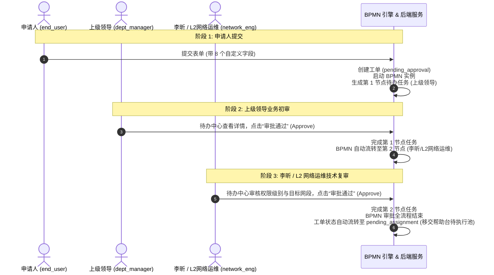

# SSL-VPN 服务申请与多级审批端到端场景验证设计 (SSL-VPN Approval E2E Verification Design)

**Status:** Approved — pending spec self-review, then hand off to `writing-plans`  
**Date:** 2026-08-24  
**Authors:** Antigravity Team  
**Scope:** 服务目录申请 -> 动态自定义表单 -> BPMN 双级串行审批流 (申请人 → 上级领导 → 李昕/L2网络运维) -> 审批完成移交  

---

## 1. 背景与目标

### 1.1 业务背景
在 ITSM 核心能力建设中，Helpdesk 与服务目录申请是最核心的高频入口。为了确保服务目录、动态自定义字段（Custom Fields）、BPMN 工作流引擎、SLA 监控以及待办中心能够无缝协同运作，必须通过真实业务场景进行端到端全链路验证。

本项目以旧版 ITSM（参考 `KAF_Migration_Pack` 真实生产规范）中经典的 **SSL-VPN 远程访问权限申请** 为蓝本，构建高保真度、可自动重入的双层端到端验证体系。

### 1.2 目标 (Goals)
1. **真实业务蓝本落地**：复刻真实的 8 项 SSL-VPN 业务字段与两级串行审批流。
2. **Layer 1 - 后端深度状态机验证 (API + DB + BPMN 引擎)**：
   - 验证工单创建与 8 个自定义字段在数据库（`custom_field_values`）中的完整持久化，严防 camelCase / snake_case 转换导致的丢值。
   - 验证 BPMN 流程实例（`bpmn_process_instances`）与待办任务（`bpmn_tasks`）在各审批阶段的生命周期流转。
   - 验证 SLA 计时器的挂载与运行状态。
   - 验证审计日志（`audit_logs`）对关键动作的留痕。
3. **Layer 2 - 前端真实多角色 Playwright UI 走查**：
   - 模拟 **申请人 (`end_user`)**、**上级领导 (`dept_manager`)**、**李昕/L2网络运维 (`network_eng`)** 3 个独立角色的真实浏览器页面交互。
   - 验证动态表单渲染、待办中心列表查询、审批弹窗交互及状态 Badge 响应式更新。

### 1.3 非目标 (Explicit Non-Goals)
- **开通执行环节**：帮助台坐席手动/自动开通配置、网络加组工具调用不在本次验证范围。
- **回填交付与关单评价**：交付参数回填（`assigned_vpn_group` 等）、标记解决（Resolve）、用户验收与 5 星满意度评价不在本次验证范围。

---

## 2. 核心业务蓝本与数据模型

### 2.1 服务目录与分类 (Service Catalog & Category)
- **服务分类 (Category)**：`网络与远程访问服务` (`network_and_remote_access`)
- **服务目录项 (Catalog Item)**：`SSL-VPN 远程办公访问权限申请` (`sslvpn_access_request`)
- **SLA 策略**：
  - 响应时效（Response SLA）：15 分钟
  - 解决时效（Resolution SLA）：2 小时（工作时间）

### 2.2 动态自定义字段模型 (Custom Field Definitions)
严格对应生产实际使用的 8 个业务字段：

| 字段标识 (`field_key`) | 字段名称 (`name`) | 控件类型 (`type`) | 必填 | 候选值 / 约束 |
|---|---|---|---|---|
| `applicant_name` | 申请人姓名 | `string` (单行文本) | 是 | 如 `侯艾华 / Sally Hou` |
| `applicant_upn` | 申请人域账号/UPN | `string` (单行文本) | 是 | 如 `shouah@kln.com` |
| `employee_id` | 员工工号 | `string` (单行文本) | 是 | 如 `EMP001` |
| `department` | 所属部门 | `select` (单选下拉) | 是 | `IT研发中心`, `供应链运营`, `财务部`, `人力资源部` |
| `vpn_level` | 申请权限级别与用户组 | `select` (单选下拉) | 是 | `Level 1 - 基础办公组 (CNDL-OKTA-SSLVPN-Level1-Users)` `Level 2 - 业务系统组 (CNDL-OKTA-SSLVPN-Level2-Users)` `Level 3 - 高权/运维组 (CNDL-OKTA-SSLVPN-Level3-Users)` |
| `target_systems` | 访问目标系统与网段 | `string` (单行文本) | 是 | 如 `10.128.35.0/24, ERP与WMS生产系统` |
| `access_duration` | 权限有效期 | `select` (单选下拉) | 是 | `30天临时`, `90天临时`, `长期有效` |
| `access_reason` | 业务申请理由 | `textarea` (多行文本) | 是 | 最少 10 字，如 `因研发排障及出差值班，需远程接入内网生产环境` |

---

## 3. BPMN 审批流程编排设计

### 3.1 审批协同链路

### 3.2 流程定义规范 (BPMN XML Nodes)
1. `StartEvent`: 工单创建自动触发。
2. `UserTask_DeptManagerApproval`:
   - 候选角色：`dept_manager`（上级主管）。
   - 任务名称：`部门领导初审 - SSL-VPN 业务申请`。
3. `UserTask_L2NetworkOpsApproval`:
   - 候选角色：`network_eng`（指定审批人标识：李昕）。
   - 任务名称：`L2网络运维复审 - VPN权限及网段合规审核`。
4. `ServiceTask_CompleteApprovalAndTransfer`:
   - 自动服务节点：将工单审批状态置为 `approved`，工单主状态更新为 `pending_assignment`。
5. `EndEvent`: 审批流程完结。

---

## 4. 验证架构与实施矩阵

### 4.1 Layer 1: 后端 API 与底层状态深度断言矩阵 (Backend Scenario Runner)

| 执行时序 | API 调用 | 操作人角色 | 核心断言点 (DB / 引擎状态) |
|---|---|---|---|
| **Step 1: 提单** | `POST /api/v1/tickets` | `end_user` | 1. `tickets.status == "pending_approval"` 2. `custom_field_values` 准确写入 8 条记录（严格检查字段名、类型与值的无损映射） 3. `bpmn_process_instances.status == "ACTIVE"` 4. `bpmn_tasks` 存在 1 条状态为 `CREATED` 且分配给 `dept_manager` 的任务 5. `sla_instances.status == "running"` |
| **Step 2: 一级审批** | `POST /api/v1/bpmn/tasks/:id/complete` | `dept_manager` | 1. 原上级审批 `bpmn_task.status == "COMPLETED"` 2. 生成新 `bpmn_task`，分配给 `network_eng`，状态为 `CREATED` 3. `audit_logs` 写入主管审批通过记录 |
| **Step 3: 二级审批** | `POST /api/v1/bpmn/tasks/:id/complete` | `network_eng` (李昕) | 1. 李昕审批 `bpmn_task.status == "COMPLETED"` 2. `bpmn_process_instances.status == "COMPLETED"`（审批阶段结束） 3. `tickets.status == "pending_assignment"` 且 `approval_status == "approved"` 4. `audit_logs` 写入网络运维审批通过记录 |

### 4.2 Layer 2: 前端 Playwright 真实多角色 UI 走查套件 (Browser E2E Suite)

| 阶段 | 登录角色 | 页面路径 | 页面交互与断言 |
|---|---|---|---|
| **1. 申请提单** | `end_user` | `/services` -> `/services/request?catalogId=...` | 1. 动态表单正确渲染 8 个自定义控件（文本框、下拉选择、多行文本） 2. 填写全部数据并提交 3. 页面提示成功并跳转至 `/tickets/:id` 4. 断言工单状态 Badge 为 `待审批`，当前步骤显示 `等待部门领导审批` |
| **2. 一级审批** | `dept_manager` | `/tasks/todo` | 1. 待办列表中出现该 SSL-VPN 申请 2. 点击进入审批详情，查看申请人填写的 8 项自定义字段 3. 输入批注并点击【同意】 4. 待办列表中该项消失，工单历史中新增主管审批记录 |
| **3. 二级审批** | `network_eng` (李昕) | `/tasks/todo` | 1. 待办列表中出现流转过来的二级待办 2. 点击查看 VPN 级别（Level 2）与目标网段 3. 输入批注并点击【同意】 4. 审批完成，工单详情页状态实时刷新为 `待分配 / 待处理` (`pending_assignment`) |

---

## 5. 测试环境就绪与隔离策略

1. **测试种子与数据准备 (Seed & Fixtures)**：
   - 预置 3 个标准测试用户：`end_user_test`、`dept_manager_test`、`network_eng_test`（李昕）；
   - 预置服务分类、服务目录项及 8 个自定义字段元数据；
   - 部署标准 BPMN 流程模型文件（`sslvpn_approval_process.bpmn`）。
2. **可重入性与清理 (Idempotency & Teardown)**：
   - 测试执行前生成带唯一时间戳标识的工单（如 `VPN-E2E-${Date.now()}`）；
   - 测试套件提供 `AfterAll` 钩子，支持自动级联清理本次运行生成的工单与流程实例。
3. **CI 集成能力**：
   - Layer 1 后端测试可在轻量 CI 中独立秒级运行 (`go test ./tests/e2e -run TestSSLVPNApprovalE2E`)；
   - Layer 2 Playwright 走查可在完整流水线或本地浏览器中执行 (`npm run test:e2e -- sslvpn-approval-flow.spec.ts`)。

---

## 6. 计划与执行路线 (Implementation Roadmap)

本设计经评审确认后，将通过 `writing-plans` 技能拆解为具体落地子任务：
1. **Task 1: 种子数据与 BPMN 流程定义准备**（创建 SSL-VPN 目录、自定义字段与双级审批流程模型）；
2. **Task 2: Layer 1 后端场景自动化测试套件实现**（编写 Go 端到端集成测试，严格断言 DB、BPMN、SLA）；
3. **Task 3: Layer 2 Playwright 多角色 UI 场景套件实现**（编写 TypeScript E2E 测试脚本与 Page Objects）；
4. **Task 4: 全链路双层回归与验证确认**（执行双层套件，生成完整测试执行报告）。
