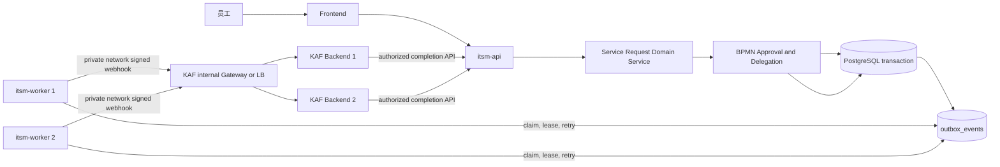

# SSLVPN 场景生产化与 KAF Worker 收敛：背景与需求

> 状态：已确认设计方向，待讨论实施方案
>
> 日期：2026-09-03
>
> 关联：[AGENTS.md](../../../AGENTS.md)、[模块化单体边界与 Worker 平台设计](2026-09-03-modular-monolith-worker-platform-design.md)

## 1. 背景

ITSM 与 KAF 是同一产品系统中的协作模块，而非彼此独立的租户或第三方业务系统：二者复用认证、身份、租户解析与 RBAC。ITSM 已具备一条可运行的 SSLVPN 服务请求闭环：Service Catalog 创建 Service Request/WorkItem，BPMN 完成两级审批，`kaf_delegate` 将履约任务事务性写入 KAF Outbox，KAF 回执再由 ITSM 的权威领域服务推进流程。

当前场景的应用内 E2E、Service Request 委派和 KAF 可靠性回归均已通过。它验证了业务和可靠性模型，不需要重新开发 SSLVPN 的目录、表单、审批或 KAF 回执业务逻辑。

现有运行形态仍将 KAF dispatcher 作为 `itsm-api` 启动时的 goroutine。API 也承载通用 Outbox、BPMN callback、通知、SLA 和 Embedding 等既有后台职责。本期只将 KAF 投递拆离；其余后台职责保持现状，后续逐项迁移，避免把 SSLVPN 首发扩大为全面任务平台重构。

本需求以已跑通的 SSLVPN 为生产化样板：不改变领域闭环，而是把 KAF 投递的唯一运行角色从 API 移至独立 Worker，并建立可复制的上线验收基线。

## 2. 目标、优先级与成功标准

### 2.1 优先级

1. **核心闭环可靠性**：KAF 投递与回执在 Worker 重启、临时失败、重复投递和人工接管时可追溯、可恢复且不重复副作用。
2. **业务上线范围**：SSLVPN 场景保持 Service Request、BPMN 审批、KAF 履约和请求人可见状态的完整闭环。
3. **生产可运行性**：具备配置预检、独立健康检查、发布切换、迁移验证、审计和基础告警。

### 2.2 成功标准

- `itsm-api` 不再启动 KAF dispatcher；本期保留其他既有后台职责，且不得执行 KAF 外部投递。
- `itsm-worker` 是 `kaf_delegate_requested` 的唯一投递执行者。
- 每个 SSLVPN 委派事件仍使用现有稳定 event ID、签名、lease、幂等与 KAF 回执契约。
- Worker 不可用、必需配置缺失、handler 未注册或外部结果不确定时，系统显式进入 `pending`、`blocked` 或人工 reconciliation；不得假成功或回退到 API 同步执行。
- 切换后，旧 API 启动入口、旧运行配置和对应测试均在同一发布批次删除。

## 3. 范围

### 本期包含

- 新增同仓库、同 Go module 的 `itsm-worker` 运行入口。
- 将现有 `KafOutboxDispatcher` 的运行责任迁移到 Worker。
- API/Worker 的 bootstrap 拆分、独立 readiness/liveness、配置预检、优雅停止和日志/指标边界。
- SSLVPN 场景的生产等价验证：审批、Outbox、KAF 投递、回执、重放、重启恢复、人工接管与审计。
- 生产部署描述增加唯一 Worker 服务和 KAF 必需配置。

### 本期不包含

- 重新设计 SSLVPN 表单、审批规则、KAF Procedure、Graph 履约逻辑或 BPMN 业务状态机。
- 引入独立微服务、RPC、独立数据库、分布式事务或全面消息队列替换。
- 同时迁移 SLA、Embedding、通知、导出或 AI Tool Queue；它们在本期后复用 Worker 基座逐项迁移。
- 启用完整 PostgreSQL RLS enforce。当前单租户上线仍保持应用层 tenant 校验和 cross-tenant fail-closed；RLS enforce 是多租户/MSP 启用前的独立硬门槛。

## 4. 架构与边界

### 4.0 已确认部署基线

- KAF 与 ITSM 使用同一认证体系；终端用户身份、tenant 与 RBAC 语义必须在两个模块中一致。KAF 自动执行仍使用受限的 `kaf_automation` 技术主体，不能把基础设施共享误解为跨域的管理员权限。
- `itsm-api`、`itsm-worker` 与 KAF 分别以 Docker 运行单元部署；Worker 是 ITSM 后端的一个运行角色，不是新的独立业务系统。
- ITSM 与 KAF 可位于不同主机；跨模块调用走私有服务器网络的内部 DNS/VIP，而不是跨主机不可用的 Docker bridge 网络。Worker 不发布宿主机端口；KAF Backend 的委派入口仅经 KAF 内部 Gateway/LB 和来源网络策略开放。
- `itsm-worker` 首期最少运行两个副本，并按无状态运行单元设计；不得配置固定容器名或依赖本地容器状态。
- 三者复用同一 PostgreSQL **实例**及基础设施。ITSM 与 KAF 使用独立逻辑数据库和独立数据库用户；双方只能访问各自拥有的数据库，不得以共享实例为由直接读写对方领域表。
- 生产密钥以 Docker secrets 的只读文件形式按运行角色注入，不能写入镜像、Compose 文件、环境文件或日志。
- API 与 Worker 共享 ITSM 的数据库访问边界；Worker 仅访问 Outbox 及其运行所需的 ITSM 表。KAF 与 ITSM 仍通过既有任务范围 API、Outbox webhook 和完成回执契约协作。

### 4.1 领域边界

- KAF 与 ITSM 共享统一的认证、身份、tenant 解析和 RBAC；KAF 不是独立租户，也不信任请求体自报的用户、tenant 或角色。
- ITSM 后端仍是 Service Request、WorkItem、BPMN、权限、tenant、审计和最终状态的唯一事实源。
- KAF 是同一系统内的智能执行域：只在明确委派的 task scope 内执行 Procedure/Tool，并通过既有受权回执 API 请求 ITSM 变更；KAF 不直接写 ITSM 数据库。
- 首期 CTI 由 ITSM 在 `kaf-context` 中按任务投影为最小快照；KAF 不读取 ITSM CTI 表，也不持久化第二份 CTI 字典事实。
- Worker 只负责 claim、投递、重试和执行状态；它不得绕过拥有业务事实的 Domain Service 直接更新跨域 Ent 表。
- 领域事件继续由事务内写入 Outbox 保证；本期不把 KAF 事件改造成新旧并行的 Event/Delivery/Job 模型。

### 4.2 运行边界

| 运行角色 | 允许职责 | 禁止职责 |
|---|---|---|
| `itsm-api` | HTTP、认证、RBAC、tenant 解析、同步领域命令/查询、事务写 Outbox，以及本期未迁移的既有后台职责 | 启动或执行 KAF dispatcher、KAF 外部投递 fallback |
| `itsm-worker` | KAF handler 注册、Outbox claim/lease/retry、签名投递、投递健康与积压指标 | 注册 HTTP 路由、改变专业状态机、绕过领域服务写业务事实 |
| `itsm-migrate` | Ent schema、post-schema migration、验证脚本 | 常驻业务或投递执行 |

### 4.3 基础设施共享不改变数据边界

共享 PostgreSQL 实例、Docker 基础设施和认证体系，是降低首期运维成本的部署选择；它不改变以下边界：

- ITSM 的领域数据只能由 ITSM 领域服务和受控 Worker 写入；KAF 不持有该数据库凭据。
- KAF 的 Procedure、Tool、执行恢复和内部台账只由 KAF 写入；ITSM 不直写 KAF 的数据。
- 跨模块状态变化仍须经已定义的 HTTP 契约、签名/技术主体、task scope、tenant、版本与审计校验，不能用共享数据库替代。

## 5. 不可妥协的设计约束

### ADR-1：硬切换，禁止双路线与兼容层

本期不是“先新增 Worker、保留 API 备用”的灰度双执行。上线版本必须保证：

1. Worker readiness、KAF 配置和端到端验证先满足发布门槛。
2. 部署 Worker，确认其成为唯一 `kaf_delegate_requested` consumer。
3. 在同一发布变更中删除 API 的 KAF dispatcher 启动入口、旧配置和旧测试。

不得存在 API + Worker 同时消费、双写、双读、兼容 adapter、别名、`Worker 不可用则 API 执行` 或未知 handler 静默跳过。

**理由：**长期双路径会制造重复副作用、难以判定的责任归属和不一致的故障语义，违反 `AGENTS.md` 的单一权威来源与 fail-closed 原则。

### ADR-1A：共享 PostgreSQL 实例，但使用独立逻辑数据库与最小权限角色

首期采用共享 PostgreSQL 实例以控制运维复杂度；ITSM 与 KAF 分别拥有独立逻辑数据库和最小权限数据库用户。每个系统至少区分 runtime 用户与 migration 用户；KAF 不拥有 ITSM 数据库的 `CONNECT`/对象权限，ITSM 运行账号也不拥有 KAF 数据库的写权限。跨模块协作继续使用既有契约，不建立跨数据库查询或直接写入。

**理由：**这同时满足同一系统的部署成本目标和 8 月设计确定的领域权威边界。现有 ITSM 与 KAF 的连接、迁移和连接池均以各自数据库为边界；强行改为同库不同 schema 会扩大首次上线的迁移风险。直接共享表或数据库账号则会绕过 task scope、BPMN、审计和幂等契约。

### ADR-1B：跨主机私有网络经内部 Gateway/LB 调用

保留现有 Docker Compose 作为部署载体，不引入 Docker Swarm。ITSM Worker 通过私有服务器网络的内部 DNS/VIP 调用 KAF 的专用委派 webhook；KAF Gateway/LB 再分发到多个 KAF Backend。KAF Backend 通过 ITSM 的内部 API 地址调用任务范围 context 与 completion API。两个方向均以来源主机/网段策略限制，且只暴露所需精确路径。

Docker bridge 网络只在单台主机内有效，不能作为 KAF 多主机部署与 ITSM 的跨主机服务发现方案。内部网络也不是授权边界：任务范围技术身份、签名、tenant/RBAC、数据库用户与逻辑数据库隔离仍为必需控制。

**理由：**KAF 已有多主机双 Backend 与 Gateway/LB 运行形态。继续使用该能力，避免引入 Swarm 或第二套编排平台；同时避免让 ITSM Worker 直接依赖某个 KAF Backend 实例。

### ADR-1C：生产环境使用 Docker secrets 的最小权限注入

生产容器从只读 secret 文件读取必需凭据。ITSM API/Worker 获取其 ITSM 逻辑数据库凭据；KAF 获取其 KAF 逻辑数据库凭据及任务范围自动化凭据；KAF webhook 共享密钥只提供给需要签名或验签的运行单元。JWT 签发密钥不应因“统一认证”而自动分发给所有容器。

缺少、不可读或不合规的必需 secret 必须令相应服务启动失败或 readiness 失败；不得使用空值、开发默认值、日志打印或 API fallback 继续运行。

**理由：**同一基础设施不等于共享高权限凭据。按角色分发 secret 可以限制单一容器泄露的影响范围，并保留 KAF/ITSM 的数据与授权边界。

### ADR-1D：Worker 至少两个副本，以 Outbox lease 进行竞争消费

首期以不少于两个 `itsm-worker` 副本运行。所有副本使用同一 KAF handler 注册和配置，通过既有 Outbox 条件 claim、lease 与 claim token 竞争消费；同一事件在同一有效 lease 内只能由一个副本完成投递状态更新。Worker 不使用固定容器名、进程本地队列或本地文件保存任务事实。

滚动发布或单副本故障时，存活副本继续 claim 新事件；已被终止副本持有但未完成的事件仅在 lease 到期后恢复，不允许另一个副本在 lease 有效期内抢占。外部副作用仍依赖既有 event ID、KAF delivery 去重和完成回执 replay-only 语义。

**理由：**两个副本提供进程级可用性，同时复用已存在的可靠投递模型，不引入第二个队列、leader 选举或 API fallback。

### ADR-1E：首期以任务级 CTI 快照供 KAF 选择 Procedure

ITSM 在 KAF 已获授权的 `kaf-context` 响应中，按 `ProcessTask.tenantId` 与关联 WorkItem 的持久化 CTI 关系生成最小 CTI 快照：仅包含分类层级的稳定 ID、code 与显示名称。它不得相信 KAF 请求或可变 BPMN 变量自报的 CTI。

KAF 只在本次 delegated task 内使用该快照辅助选择 Procedure；不读取 ITSM 数据库、不复制全量 CTI 字典、不建立同步任务。若未来对话式受理必须检索完整 CTI，再单独设计 tenant-scoped、只读、版本化的 CTI Catalog API。

**理由：**SSLVPN 委派只需要当前任务的权威分类。任务投影满足最小披露和单一事实源，不把“读取一份字典”演变成跨库耦合或长期数据同步。

### ADR-2：本期复用 KAF Outbox 契约，不提前泛化

`KafOutboxDispatcher` 已具备签名、claim token、lease、重试、ambiguous delivery 和审计基础。本期只移动其运行位置，不在 SSLVPN 切换中同时替换为 `outbox_deliveries`/`async_jobs`。

后续第二个实际 consumer 出现时，再以独立迁移将通用事件事实与每个目标投递状态分离；该迁移也必须单路径切换，不能长期兼容两种 schema。

### ADR-3：失败显式化并保留人工处理

- 网络/限流/临时 5xx：按既有退避策略重试。
- 必需配置、签名、权限、handler 或契约错误：`blocked`，写审计和可操作错误分类。
- 外部调用已发起但结果不确定：不盲目重试，保留证据并进入人工 reconciliation。
- 重放必须复用既有稳定 idempotency key，具备 RBAC、tenant、原因和审计；不得重新执行已确认完成的 KAF Procedure。

### ADR-3A：ITSM 主导人工对账，Langfuse 仅作为受控的 KAF 会话证据

KAF 的 Langfuse 已保存全量会话，可为人工处理提供 Procedure 调用、模型/工具轨迹、输入输出和错误上下文。它是 KAF 侧的**取证与诊断系统**，不是 WorkItem、BPMN、投递状态或授权事实源；ITSM 仍是这些事实的唯一权威写入方。

运营入口放在 ITSM：平台运维按 `tenantId + taskId + eventId + correlationId` 查询委派状态，并可跳转到同一 correlation 的 KAF/Langfuse 证据。请求人和审批人只看到通用、无敏感内容的处理状态。Langfuse 不向其开放，也不得由浏览会话记录直接推进或修复 ITSM 状态。

| 状态 | 默认动作 | 人工操作与证据要求 |
|---|---|---|
| `pending` / `retry` | Worker 自动退避重试 | 只读观察；不触发同步补偿 |
| `blocked` | 停止投递 | 平台运维修复配置/注册/权限后，以原因审计的 requeue 恢复原 event ID |
| `delivery_unknown` | 停止重投 | 必须先核对 KAF durable delivery、完成回执和 Langfuse 会话；无“未接受且未开始”的明确证据时，禁止 force resend |
| KAF `retryable` | KAF 恢复机制处理 | 超过阈值告警；人工仅核对证据与依既有恢复语义继续 |
| KAF `failed_auth` | 停止执行 | 修复技术认证/授权后，由具备权限的人员恢复；不得绕过 tenant/task scope |

人工入口必须以能力而不是硬编码角色授权：`delegated_execution.view`、`delegated_execution.requeue`、`delegated_execution.reconcile`。所有 requeue、reconcile 结论与状态修复都要求原因、操作者、时间、关联 ID 和审计记录。Langfuse 查询仅授予最小范围的平台运维人员；按 KAF 的数据保留、脱敏和导出策略处理全量会话，严禁在 ITSM 日志、Outbox payload、工单公开评论或 API 响应中复制完整会话、提示词、令牌或敏感业务内容。

**理由：**全量会话能显著缩短不确定投递的人工判断，但若将其当作可写的业务真相，会形成跨系统双状态机和越权泄露面。以 ITSM 编排操作、以 KAF durable state 和 Langfuse trace 交叉取证，保留单一事实源与不可重复副作用约束。

### ADR-3B：首期采用“事件年龄优先”的可配置告警基线

当前 KAF Outbox 默认轮询间隔为 5 秒、单次 webhook 超时为 10 秒、投递 lease 为 5 分钟。由于尚无生产吞吐基线，首期不以固定 backlog 数量作为单独 paging 条件；以 oldest pending/retry age、Worker ready 副本数和显式失败状态为主。所有阈值必须由部署侧告警规则配置，不得写死在 Worker 业务代码中。

| 信号 | 首期阈值 | 级别与处置 |
|---|---|---|
| ready Worker 副本数 | 0 持续 1 分钟；少于 2 持续 5 分钟 | 前者 Critical，平台值守 10 分钟内确认；后者 Warning，恢复冗余或升级 |
| oldest `pending` / `retry` event age | 超过 2 分钟；超过 10 分钟 | 前者 Warning，核对 Worker/KAF Gateway；后者 Critical，按事件对账，不启动 API fallback |
| `blocked` 或 `delivery_unknown` | 任意新事件 | 作为上线后可观测性 Backlog 的 Critical 告警项；在未启用邮件告警前，平台按 ITSM 对账入口与运行日志处理，`delivery_unknown` 只走 ADR-3A 的取证流程 |
| 单 event 连续 retry | 第 3 次；第 6 次 | 前者 Warning；后者 Critical，并按错误类别聚合避免告警风暴 |
| KAF 回执端到端延迟 | 委派 event 创建至 KAF accepted 的 p95 超过 60 秒（15 分钟窗口） | Warning；连续 30 分钟未恢复则 Critical，并以真实流量基线复核 |

Critical 告警的责任主体为平台值守：10 分钟内确认、30 分钟内完成初步分流（Worker、网络/Gateway、KAF、认证或外部系统），2 小时内给出恢复或人工接管计划。Warning 在 30 分钟内确认、4 小时内处理或说明延期原因。上述是首期运行目标，不是 SLA 承诺；受控 SSLVPN 演练和上线后前两周的实际分位数据用于调整阈值，并记录变更原因和生效时间。

**理由：**在低量首发阶段，积压数量会随业务量变化而失真，事件年龄直接表达用户等待和可靠性风险；显式失败立即升级，避免让退避重试掩盖需要人工判断的故障。

### ADR-3C：首期以配置化邮件发送平台告警

ADR-3B 的 Warning 与 Critical 告警均通过邮件投递到平台值守收件人。收件人使用部署侧 `KAF_ALERT_EMAIL_RECIPIENTS` 配置（逗号分隔、至少一个有效地址），不得写入代码、镜像、数据库 seed 或业务 workflow；发送账号和 SMTP/Graph 凭据继续通过受保护 secret 注入。生产 Worker readiness 或部署预检在告警已启用但收件人缺失、格式无效或邮件投递器未配置时失败。

邮件主题包含环境、告警级别、错误类别和稳定关联 ID；正文只包含 event/task/correlation、首次发生时间、当前状态、重试次数和受权 ITSM 操作入口。禁止携带 Langfuse 会话、完整 payload、提示词、令牌、附件、个人敏感信息或原始外部错误内容。相同告警指纹（环境、错误类别、event ID）在 30 分钟窗口内只发送一次；恢复时发送一封恢复通知。邮件投递失败本身必须形成可见指标/日志和运维待处理项，但不得因无限自发重试造成告警风暴。

ITSM 已有 SMTP/Graph 邮件发送能力可以作为投递适配器，但告警生成、去重、投递结果和审计必须作为 Worker/可观测性边界的独立能力实现；不能将普通 SR 通知、审批邮件或请求人邮箱借作值守收件人。

**理由：**邮件适合首期且运营成本低；将收件人、投递凭据与告警规则解耦，避免硬编码人员与租户业务数据。显式去重、恢复通知和失败可见性确保邮件链路本身不会成为无声故障或告警风暴来源。

## 6. 功能需求

| 编号 | 需求 | 验收条件 |
|---|---|---|
| FR-1 | SSLVPN SR 创建与 BPMN 审批行为不变 | 既有场景测试和真实 API 路径均可完成两级审批并创建委派任务 |
| FR-2 | Worker 是 KAF 投递唯一执行者 | API 运行时无 KAF dispatcher goroutine；仅 Worker 可 claim KAF 事件 |
| FR-3 | 投递可靠性不退化 | 已有签名、lease、幂等、重试、ambiguous 和回执重放回归全部通过 |
| FR-4 | Worker 重启可恢复 | lease 未过期时其他 Worker 不得完成；过期后仅一个 Worker 可恢复 claim |
| FR-5 | 失败可运营 | pending、retry、blocked、dead-letter/人工 reconciliation 状态可按 tenant、event ID、task ID 查询且无敏感 payload dump；平台入口可按 correlation ID 跳转受权 KAF/Langfuse 证据 |
| FR-6 | KAF 回执仍受控 | 回执只可在授权 tenant、delegated task、允许 action 和预期版本下推进 BPMN |
| FR-7 | 可见性不回退 | 请求人和审批人继续通过既有 SR/BPMN 状态查看进度；前端不推断授权或伪造履约成功 |
| FR-8 | KAF 获得权威 CTI 语义 | `kaf-context` 返回由 ITSM 持久化关系生成的任务级 CTI 快照；错误 tenant、缺失/无效 CTI 或伪造 BPMN 变量均不能改变 KAF 获得的 CTI |
| FR-9 | 对账不产生第二状态机 | `delivery_unknown` 只能由具备 `delegated_execution.reconcile` 的人员基于 KAF durable delivery、回执与 Langfuse 会话作出结论；无未接受/未开始证据时不能重发 Procedure，所有结论留存 ITSM 审计 |

## 7. 非功能与运行需求

| 编号 | 需求 |
|---|---|
| NFR-1 | Worker 启动时验证 KAF handler、Webhook URL、secret、poll interval、数据库连接；缺少 required 配置则 readiness 失败，不接受“空转正常”。 |
| NFR-2 | API readiness 仅表示同步 API 可用；Worker readiness 独立表示 KAF handler、claim 与 backlog 检查可用。 |
| NFR-2A | **Backlog（由部署方处理）：**Worker 必须通过 KAF 内部 Gateway/LB 的专用委派路径连接，KAF Backend 必须通过 ITSM 内部 API 路径回执；部署预检验证 DNS/VIP、私网 HTTP 入口的来源网络策略与两端健康检查，不允许依赖单一 Backend IP。TLS/mTLS 也是独立安全加固 Backlog；未启用时不得宣称传输加密已验证。 |
| NFR-3 | 输出 worker backlog、oldest pending age、claim/recovery、retry、blocked、ambiguous、completion latency 指标；日志只含 allowlisted tenant/task/event/status/error class。 |
| NFR-4 | Worker 收到 SIGTERM 后停止新 claim，等待有限时间内的 in-flight 请求结束；未完成事件依赖 lease 过期恢复。 |
| NFR-4A | 生产部署至少维持两个 ready Worker 副本；单个副本重启、异常退出或滚动发布不得使新 KAF 投递停止。 |
| NFR-5 | 生产密钥通过受保护环境/secret manager 注入，严禁记录 KAF webhook secret、token、完整 payload、附件路径或原始 Graph 结果。 |
| NFR-6 | 发布前必须在共享 PostgreSQL 实例、独立逻辑数据库与独立 DB 用户的生产等价环境运行 migration verify、Worker 重启、投递失败、回执重放和真实跨进程 API/KAF 验证。 |
| NFR-7 | 发布前以实际运行账号验证数据库权限：ITSM API/Worker 仅可连接和访问 ITSM 数据库，KAF 仅可连接和访问 KAF 数据库；任何跨数据库连接、查询或写入均必须被 PostgreSQL 拒绝并留存验证证据。 |
| NFR-8 | Langfuse 全量会话按 KAF 的 tenant/task/correlation 关联并最小授权访问；ITSM 仅保存可安全索引的关联 ID 和操作结论。会话的脱敏、保留期限、导出审批与删除责任必须在上线前由 KAF 平台明确并验证。 |
| NFR-9 | Worker 在上线前暴露按安全 allowlist 标签聚合的 ready replica、KAF event backlog、oldest pending/retry age、retry attempt、blocked、delivery unknown 和委派至 KAF accepted latency 指标；告警规则在部署侧配置、版本化并经演练验证。 |
| NFR-10 | **Backlog：**启用告警时 `KAF_ALERT_EMAIL_RECIPIENTS` 是必填的部署配置；邮件投递凭据来自 secret。告警邮件只含 allowlisted 关联信息，按告警指纹在 30 分钟内去重，并暴露投递成功/失败与恢复指标。未完成前不得宣称邮件告警已上线。 |

## 8. 发布与回退原则

### 发布前门槛

- SSLVPN 应用内 E2E、Service Request/KAF 委派、KAF Outbox、回执 fencing/replay 回归全部通过。
- 生产等价环境中，ITSM API、Worker 和 KAF 是独立进程；完成一次真实跨进程 SSLVPN 演练及清理验证。
- Worker handler 与 KAF 配置通过 readiness；无历史 pending KAF 事件由旧 API consumer 持有。
- 邮件告警收件人、发送凭据、去重窗口与恢复通知是独立 Backlog；未实现时不得将邮件链路列入本次上线证据或宣称已具备告警邮件能力。
- migration status、verify SQL、备份与恢复演练均有可审计证据。

### 硬切换步骤

1. 部署包含 API 停止 KAF dispatcher 和 Worker 启动入口的同一版本。
2. 启动 Worker，检查 readiness、handler 注册和 KAF 连接配置。
3. 停止旧 API 实例，等待其 KAF lease 到期或完成；再启动新 API 和不少于两个新 Worker 副本。
4. 创建并完成一条受控 SSLVPN 验证请求，核对 Event、Worker、KAF 回执、BPMN、AuditLog 和请求人状态。
5. 删除旧启动代码、部署定义、配置项和测试入口。

### 故障处理

运行切换后以 **forward recovery** 为原则：保留 pending/blocked 事件和审计证据，修复 Worker 或配置后恢复执行。不得启动旧 API dispatcher 作为临时兼容回退；这样会重新引入双 consumer 风险。

### 首次真实 SSLVPN 演练 Runbook（第一阶段）

代码与静态部署定义的已验证/待验证边界记录在
[Production Readiness Evidence Report](../../reports/2026-09-03-sslvpn-kaf-worker-production-readiness-report.md)。
该报告为 Conditional No-Go 时，不得将本节的演练步骤视为已完成的生产验收。

本阶段已获准使用 [KAF 委派发布收口真实变更夹具](../../testing/kaf-delegation-release-closeout-fixture.md) 所定义的专用测试对象完成一次实际组成员授予与回收。该夹具是测试身份、目标组和恢复 Tool 的唯一事实源；本文不复制对象标识。演练部署必须具备生产等价的 API、至少两个 Worker、副本间 claim、KAF Gateway/LB、独立数据库角色、secret 与邮件告警拓扑，但不得使用生产凭据、真实员工身份、一般 VPN 用户组或 LDAP 路径。

| 责任 | 最小权限与职责 |
|---|---|
| 测试请求人 | 仅能创建该受控 SSLVPN Catalog 请求；无审批、运维或目录配置权限 |
| 审批人 | 仅完成该请求对应的两级 BPMN 审批；不得修改流程定义或 KAF 配置 |
| KAF automation 身份 | 仅能完成 task-scoped KAF 回执，并经 Microsoft Graph 仅管理夹具指定测试组的成员关系 |
| 平台值守 | 可查看 Worker、Outbox、KAF delivery、Langfuse 证据与邮件告警；可执行受审计的对账/恢复，但不借此获得业务审批权限 |
| 外部系统恢复负责人 | 负责执行前/后只读成员查询、恢复 Tool 调用与回收失败人工处置；回收完成前不得宣布演练成功 |

#### Go / No-Go 前置条件

1. 演练窗口、平台值守和外部系统恢复负责人均已确认；恢复负责人可在窗口内处理失败。邮件告警值守收件人为独立 Backlog，不是本次受控演练的前置条件。
2. API、两个以上 Worker、KAF Gateway/LB、KAF Backend、数据库边界和 required secrets 的 readiness 均通过；API 未运行 KAF dispatcher。
3. 邮件告警和 `KAF_ALERT_EMAIL_RECIPIENTS` 为独立 Backlog；本次演练不得把未实现的邮件链路作为已验证控制。
4. 由恢复负责人通过 Microsoft Graph 只读确认专用测试身份不是目标组成员；若已是成员，先执行受控移除并再次只读确认。未获得非成员基线即 No-Go。
5. 为本次演练登记唯一 change/reference ID；所有请求标题、日志检索与证据包只使用该标识，不填入密码、token、附件或真实业务敏感内容。

#### 执行与证据

1. 测试请求人创建一条受控 SSLVPN SR；两位审批步骤按正常 BPMN 完成。
2. 平台值守记录 `taskId`、`eventId`、`correlationId` 和 Worker claim，确认仅生成一个 `kaf_delegate_requested` 事件并由 Worker 投递。
3. KAF 使用受权 task-scoped context 执行夹具指定的授权 Tool；恢复负责人通过 Microsoft Graph 只读确认成员从非成员变为成员。
4. 重放同一 completion/action 语义，确认不产生第二次 Graph 副作用，BPMN 只推进一次；收集 ITSM AuditLog、Outbox 投递状态、KAF durable delivery、回执与受权 Langfuse 关联证据。
5. 恢复负责人调用夹具指定恢复 Tool，并通过 Microsoft Graph 只读确认成员恢复为非成员；记录恢复完成时间。
6. 记录该链路的运行状态与人工对账入口；邮件告警验证属于独立 Backlog，不在本次演练中伪造或替代为已完成。

#### 成功、停止与清理

只有同时满足“一个外部授权副作用、一次 BPMN 推进、完整关联审计、最终非成员状态、无敏感证据泄露”才可判定第一阶段通过。任何外部授权或回收结果不确定、成员回收失败、重复副作用、跨 tenant/权限拒绝异常或发现敏感内容泄露时，立即停止后续演练：保留证据，优先恢复目标组成员状态，并按 ADR-3A 对账；不得以 API fallback、重发 Procedure 或手工改写 ITSM 状态绕过失败。邮件告警能力的缺失保持为单独 Backlog，不得在该范围内被错误标注为通过。

## 9. 验收矩阵

| 场景 | 必须证明 |
|---|---|
| 正常履约 | SR → 两级审批 → Worker 投递 → KAF → 回执 → BPMN 完成，且仅一次副作用 |
| Worker 重启 | 未完成 lease 不能被并发完成；失效 lease 可由新 Worker 恢复 |
| 多副本竞争 | 两个以上 Worker 同时运行时，同一 event 只允许一个有效 claim、一次 KAF delivery 和一次投递终态更新 |
| 外部暂时失败 | Event 保留、退避重试、最终成功或可见终态；无丢失和无 API fallback |
| 外部结果不确定 | 转人工 reconciliation；不重复运行 Procedure |
| 人工对账 | ITSM 入口展示 event/task/correlation 与状态；受权平台人员可关联查阅 KAF durable delivery 和 Langfuse 会话；无“未接受且未开始”证据时拒绝重发，并审计结论 |
| 告警与值守 | **Backlog：**模拟 Worker 全失、单副本降级、网络超时、第三/第六次重试、`blocked` 与 `delivery_unknown`；实现后验证 ADR-3B 的级别、去重、路由、确认时限和恢复/对账记录 |
| 告警邮件 | **Backlog：**缺失/无效收件人或发送器时 readiness/部署预检失败；Critical 告警投递至配置收件人，30 分钟内相同指纹去重，恢复后通知；邮件与投递错误均不含 trace、payload 或凭据 |
| 真实 SSLVPN 演练 | 在生产等价拓扑中使用夹具唯一测试对象：从非成员基线经一次授权到一次回收；一条 event/一次 KAF delivery/一次 BPMN 推进；收集关联审计证据，最终确认无外部权限残留 |
| 重放 | 使用原 completion payload/idempotency key，不再次执行已完成 Procedure |
| 未注册/错误配置 | Worker non-ready 或 Event blocked，有审计与操作说明 |
| 网络边界 | Worker 只能经 KAF 内部 Gateway/LB 投递，KAF 只能经 ITSM 内部 API 回执；来自未允许来源或绕过 Gateway 的请求均被拒绝 |
| 授权与隔离 | 非授权 KAF 回执、错误 tenant、过期 lease、版本冲突均显式失败 |
| 数据库边界 | 使用 KAF 实际数据库用户连接/访问 ITSM 数据库，以及使用 ITSM 实际运行用户连接/写 KAF 数据库，均被 PostgreSQL 拒绝 |
| CTI 边界 | KAF 只经 task-scoped `kaf-context` 获得当前任务 CTI 快照；无 ITSM 数据库查询、无全量字典复制，且快照与 ITSM 持久化 CTI 一致 |
| 可观测性 | 可按 tenant 与 task/event 查询状态、延迟和错误分类，且不暴露敏感内容 |

## 10. 后续可复用边界

SSLVPN 完成生产化后，Worker 基座可依次承载通知、SLA、Embedding、Connector/Webhook、导出和 AI Tool Queue。每一项必须保留自己的领域语义并单独经历“新路径验收 → 同版删除旧路径”的硬切换；不得将它们塞入无类型、无审计的通用队列。

## 11. 数据库工作包与下一轮决策

### 11.1 已确认的数据库工作包

| 工作包 | 交付内容 | 完成标准 |
|---|---|---|
| DB-1：实例与角色 | 在共享 PostgreSQL 实例中创建 ITSM 与 KAF 的独立逻辑数据库；创建各自的 runtime 与 migration 用户；撤销跨库 `CONNECT`、对象与默认公共权限 | 最小权限清单经 DBA 复核；运行用户不能执行 DDL；迁移用户不能被常驻容器使用 |
| DB-2：迁移与初始化 | ITSM 仅由 `itsm-migrate` 执行 Ent/post-schema migration；KAF 仅由一次性 KAF migration job 执行 Alembic；常驻服务关闭自动迁移 | 两个迁移命令可在空库与生产等价备份恢复库重复执行；版本记录、校验与失败退出均可审计 |
| DB-3：运行配置 | API、Worker、KAF 分别使用 Docker secrets 注入自己的 runtime 数据库连接；连接池上限按实例预算配置 | 启动日志不泄露 DSN/密码；错误账号、错误数据库、缺少 secret 均 fail closed |
| DB-4：边界验证 | 使用实际 runtime 与 migration 账号执行正向连接、跨库拒绝、DDL 拒绝、备份恢复和双 Worker/KAF Backend 并发验证；验证 KAF 的 CTI 仅来自 task-scoped API 投影 | 形成可复现 SQL/命令与审计证据；不依赖高权限手工修复 |

如需将已有 KAF 或 ITSM 数据迁入共享实例，必须单独增加“数据迁移与回退”工作包，先确认保留范围、停写窗口、备份校验和恢复责任；不得在 Worker 硬切换中顺带复制数据。

### 11.2 下一轮讨论需要决策的事项

1. 第一阶段演练通过及上线后两周数据完成后，确认是否调整 ADR-3B 的事件年龄、retry 与延迟阈值。

### 11.3 上线后 Backlog：既有数据迁移

是否将已有 KAF/ITSM 数据迁入共享 PostgreSQL 实例暂不讨论，且不构成 SSLVPN 首发、Worker 硬切换或第一阶段真实演练的前置条件。仅当未来明确需要保留历史运行数据时，才新建独立“数据迁移与回退”工作包，确认数据范围、停写窗口、备份校验、恢复责任与验收证据；不得顺带加入任何当前发布批次。

### 11.4 独立 Backlog：Langfuse 数据治理与邮件值守

KAF/Langfuse 会话的脱敏、保留、导出、删除与责任归属，以及生产 `KAF_ALERT_EMAIL_RECIPIENTS` 的值守邮箱组配置，由产品/平台负责人单独处理。本项不阻塞当前 Worker/SSLVPN 实施范围；但在真正生产启用全量会话访问或邮件告警前，仍必须完成 ADR-3A、ADR-3C、NFR-8 与 NFR-10 规定的权限、数据治理和演练门槛。
