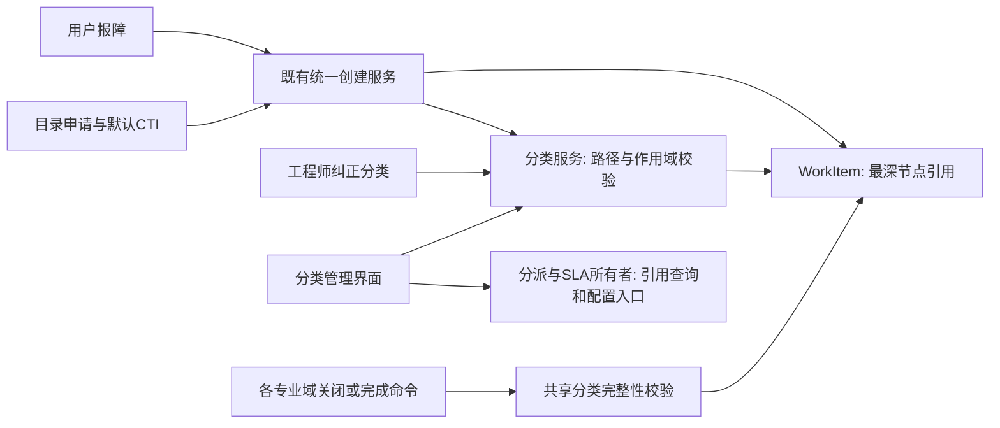

# CTI 三级分类、目录关联与完成质量设计

- 状态：accepted；**代码已交付，目标未启用**（2026-09-17 起分阶段实现；PR #48 / 分支 `codex/feat/cti-governance`）。
  - 已交付（有实现与测试证据）：分类结构治理与受控迁移 048、目录默认分类、完成质量门禁与不可变启用边界、分类纠正留痕、规则 exact/subtree 范围、授权引用清单。
  - 未启用（无任何共享/生产写入）：迁移 048 **未在任何共享或生产库应用**，门禁**未在任何租户启用**。
  - 未完成：端到端浏览器验收（脚本已交付但 **NOT RUN**，需隔离前端部署）、变更单界面的分类字段、`disabled`/`default_resolver` 历史描述字段的界面收敛。
  - 启用所需的备份/迁移/补配/开关/暂停/复验步骤见 [CTI 治理受控启用清单](../../operations/cti-governance-rollout-checklist.md)。
- 日期：2026-09-17。
- 基线：origin/main `b8ac9639b4197c9c93ee2e72747e46bf59958664`。
- 范围：统一分类维护、目录默认分类、分类变更及专业完成质量。此文不授权共享数据库迁移、数据清理或环境部署。

## 1. 目标与权威关系

终端用户表达需求，目录提供标准申请的默认分类，工程师对实际工作的分类准确性负责。后台保持最多三级的 CTI，前台按场景决定是否要求完整填写。

必读：[AGENTS](../../../AGENTS.md)、[工程治理](../../agent-engineering-governance.md)、[工程约定](../../engineering-conventions.md)、[开发指南](../../DEVELOPMENT_GUIDE.md)、[环境](../../development-environment.md)。本设计扩展分类与完成质量约束，不改变 WorkItem 的专业生命周期所有权、事务、权限、租户、BPMN、SLA 或迁移治理。

背景与取代关系：

- [原 WorkItem 设计](2026-08-26-unified-work-item-model-design.md)：复用统一运营分类、目录默认分类、目录与模板分工；其目标字段不等于已实现字段。
- [9 月 2 日创建设计](2026-09-02-unified-intake-workitem-creator-remediation-design.md) §3 中仅取一级 CategoryID 的早期描述，在本范围由“持久化所选最深节点”取代；不按旧文字回退现有实现。[后续实施说明](../plans/2026-09-02-unified-intake-p1-reconciliation.md)及当前代码用于核对。
- [专业生命周期](2026-09-09-workitem-convergence-design.md)：保留恢复、解决、关闭、验证、重开及 SLA 周期边界。分类质量不能延迟真实恢复事实的记录。
- [9 月 14 日迁移设计](2026-09-14-legacy-config-migration-gap-and-solution-design.md)：新分类树为权威，旧 CTI 仅为映射来源。本任务不迁移旧 ticket，不重放旧路由。
- [五批对账](../../review/2026-09-15-five-batch-reconciliation-report.md)：历史批次证据不是当前数据库状态或本任务验收。

## 2. 概念与业务场景

| 概念 | 权威及用途 |
| --- | --- |
| recordClass | WorkItem 专业类，决定专业生命周期；不是 CTI 的 Type |
| CTI | Category → Type → Item，业务范围分类，最多三级 |
| Catalog Item | 可申请服务的定义，拥有表单、目标专业类、默认 CTI 及既有流程/SLA 配置 |
| 目录分组 | 用户浏览目录的展示分组，不自动映射 CTI |
| Catalog Task | 执行任务，不等同 CTI Item；本次不新增人工三级填写要求 |

示例：目录“SSLVPN 权限申请”预设“网络服务 → 远程访问 → VPN”；用户只填申请原因与有效期。另一位用户报告 VPN 无法连接，可先不分类，服务台确认后用同一业务分类，但它是 Incident，走恢复故障的专业流程。工程师发现实为账户锁定，可纠正当前工单分类，记录原因；不修改目录默认值，不自动改派、重算 SLA 或重启流程。

## 3. 路径选择及取舍

1. **采用：整体契约、两阶段交付。** 同时明确分类、目录和处理边界，按基础/创建与处理/完成分段验收。复用现有服务，避免页面先行形成错误承诺。
2. 仅改页面：成本低，但无法解决无限深度、目录关联缺失及完成质量；不作为整体交付。
3. 分类节点内嵌全部分派/SLA/流程配置：入口集中，但会产生第二套权威与冲突优先级；不采用。

## 4. 当前证据与目标差距

- `ent/schema/ticketcategory.go` 使用 parent_id/level，另有 department_id、itsm_type、default_priority、sla_tier、default_resolver、is_user_facing；表有字段不等于运行时生效。
- `handlers/common/workitemcreation/plan.go` 将 ItemID、TypeID、CategoryID 中最深的已选节点写入 WorkItem CategoryID；`tickets` 不需增加第二套 C/T/I 文本权威。
- `service/ticket_category_creation.go` 已校验部分租户/父子关系；仍需统一完整根路径、层级、祖先启用状态与深度约束。
- 分类维护目前递归任意层级，前端父级选择未禁止三级节点，创建服务按 parent.Level+1 计算，无三级上限。
- `ServiceCatalog.category` 是展示字符串，无默认 CTI 结构引用。目录管理和申请入口使用相同目录 API。
- 分派路径接收 CategoryID，SLA 服务有分类匹配逻辑；本次源码检查不证明所有规则或页面已形成有效闭环。
- 本轮没有可信的全租户实时分类行数基线：无租户上下文的 RLS 查询不能作为空库证据。实施前须使用授权租户上下文只读盘点。

实施核对补充（2026-09-17，A1 源码只读，不构成运行时或数据结论）：

- `ent/migrate/schema.go`：`ticket_categories.code` 是**表级全局唯一**，而 `service/ticket_category_service.go` 按租户判重；两者范围不一致，须按租户契约显式处理（放宽为 `(tenant_id, code)`）。
- `tickets.category_id` 对 `ticket_categories(id)` 的外键是 `ON DELETE SET NULL`，数据库层不阻止删除被引用分类；现有仅服务层先计数再删，存在竞态窗口。
- `sladefinitions.category_ids` 为 JSON 数组；`TicketSLAService.getSLADefinition` 先取“第一个活跃定义”再判断是否包含分类，命中集合不完整。
- 分派/自动化规则的 `category_id` 条件只做叶节点精确比较，历史规则的实际匹配集合即“精确”。
- `service_catalogs.category` 是展示字符串；`default_ticket_category_id` 尚不存在，属本轮 A2 新增结构。
- 实施期间共享 Dev／迁移验证库被在途恢复任务占用，且无授权隔离 PG 目标，故本设计 §9 的 PG 与 UI 验收在执行记录中单独标注为未执行。

## 5. 已确认业务契约

### 5.1 用户提交、目录发布与分类责任

普通报障允许未分类或部分分类，不因 CTI 缺失拒绝接收、接单或记录时间；服务台分诊尽早补齐。AI 仅建议，低置信度保留待分类，本次不新增 AI 分类引擎。分派兜底及 SLA 启动复用现有机制，不能因新增 CTI 门禁丢失原有保障。

目录草稿可不完整。目录发布时配置有效三级 CTI，申请提交时后端再次校验完整路径、启用状态及租户。多个目录项可引用同一 CTI。终端用户无需重复选择。创建后实际分类归 WorkItem；目录修改只影响后续申请。

既有已发布目录先形成补配清单，完成补配并验证后才激活目录强制门禁；不能将部署新代码等同立即阻断旧目录申请。默认 CTI 增加结构化引用（建议字段 default_ticket_category_id），必须进入版本化迁移和目录版本校验，不依赖名称匹配、不从展示分组推断。

### 5.2 专业完成质量门禁

| 专业类/动作 | 已确认要求 |
| --- | --- |
| Incident | 正式关闭前三级完整；恢复/解决仅提示，不阻断事实记录和原有 SLA 时间处理 |
| Generic | 正常完成前三级完整 |
| Requested Item | 发布/申请入口保证默认三级分类；本次不替代既有审批、履约和交付完成规则 |
| Problem / Change | 各自最终关闭前检查，不取代永久修复验证、实施、评审等专业条件 |
| Catalog Task | 不新增人工重复填写或动态继承写入；现有父子关系保留，单独分类策略不在本次范围 |
| 取消、重复、误报 | 复用该专业域已有合法终止命令与原因/审计；不新增通用终止状态，不要求虚假分类 |

门禁仅作用于启用后新建工单。历史在途工单提示补齐，不因本次质量规则新增强制阻断；原有专业完成条件仍执行。旧单重开不变成新单，不自动改变其本次门禁归属。

### 5.3 分类变更与规则关联

工程师通过受控命令纠正分类：后端授权、租户校验、版本并发保护及原子审计，保存原因和修改前后信息。任何 API/批量入口都不能绕开同一约束。只变更分类，不隐式改派、重算 SLA 或重启 BPMN。

**已确认审查补充：分类纠正不得破坏服务申请的完整性。** 门禁启用后新建的 Requested Item，主动纠正必须提交当前有效的完整三级路径；拒绝完整→部分和完整→清空，允许完整→完整。历史在途单继续按 §5.2 兼容，不因新增质量要求追加强制阻断。其他允许未分类的专业类在门禁时点之前可使用部分分类，不能绕过各域原有修改权限。

分类纠正的状态范围必须由专业所有者检查，不因共用组件而开放通用终态编辑。已关闭、已完成或已取消记录不新增纠正入口，现有合法重开规则保持不变。Incident 的已解决但未关闭阶段需要可补齐 CTI，否则关闭门禁无法修复：实施计划必须核对其专业修改入口，必要时增加仅修正分类的受控动作，不开放其他字段、不执行重开、不重置 SLA；这是支持已确认关闭时点的必要能力，已纳入本次确认范围。Problem/Change 同样在最终关闭前保证合法补齐入口，不能靠回退专业状态修正分类。

Generic 的“正常完成”须在计划中逐一列出实际命令：进入 resolved 若即锁定普通编辑，分类检查必须在该动作原事务中完成；直接关闭路径也必须覆盖。不得只在后续 closed 检查而把工单留在不能补齐分类的状态。

规则来源仍是现有分派服务/SLA 策略/BPMN。分类页只聚合授权可见引用并导航到拥有者；不能复制或另存同义规则。

本次引用分类的规则明确支持“仅当前节点”和“当前节点及下级”。旧规则保留原匹配集合；有歧义的旧配置须盘点并阻止未经确认的语义扩张。规则命中优先级复用各所有者已有契约，不臆造全局优先级。变更分类不新增自动触发规则。

### 5.4 维护及历史保护

- 名称/描述可改并审计；历史工单展示当前名称，修改审计保留当时信息，不复制第二套当前分类。
- 编码创建后稳定；用户编辑不能改，既有编码/唯一性问题仅通过显式迁移处理。
- 未被引用的节点可移动；所有后代必须满足最多三级、无环、同租户。父级/层级更新原子提交。
- 被工单、目录或规则引用的节点禁止直接移动；移动祖先会改变被引用后代的路径，同样禁止。通过新建正确路径并调整后续配置解决，不重写历史工单。
- 停用后保留历史引用、禁止新选择；已发布目录引用节点或其祖先时，先调整目录才允许停用。停用父节点使其分支不可新选，子节点原启用值不批量覆写。
- 停用前已合法写入工单的完整路径（包括门禁启用后创建的在途工单），即使后来停用，仍可作为历史有效路径完成质量校验；主动改选必须选择当前有效路径，避免停用使在途工单突然无法关闭。
- 删除仅允许无子节点且无业务/配置引用；维护时展示影响，但后端在提交事务内重新验证，不能依赖先查后写防竞争。

## 6. 复用架构与数据流

- 分类服务拥有树不变量/路径解析；共享校验返回结构化失败原因，各专业服务在其既有事务内调用，不集中实现所有状态机。
- 管理、用户、坐席使用同一个 CTI 数据契约和选择组件，界面允许不同展示深度；权限由后端保障。
- 工单只持久化最深节点，C/T/I 路径为派生投影；审计快照用于历史证据，不成为第二写入权威。
- 目录默认分类解析必须覆盖创建事务中的目录版本、分类有效性和租户校验。分类维护与创建并发采用锁或等价数据库约束，保证不能创建刚被删/停用的无效引用。
- 启用边界由每个目标部署/租户记录一次受控的生效截止时间，使用服务端创建时间判定新旧；重启不重置，不使用浏览器时间。不增加工单生命周期或通用动态策略框架。具体持久化位置在计划中先核对既有配置机制再确定。
- 迁移保护基于真实 PG 结构而非仅 Ent 标签；尤其核对 code 的实际唯一性范围、外键和 RLS。无需为本任务新建数据库/schema/container。

## 7. UI 与可用性

标题“工单分类（CTI）”，说明“维护工单的三级业务分类，供工单录入、统计及处理规则引用”。左树右详情：树显示三级名称、状态、搜索完整路径；一级/二级提供新增下级，第三级不提供。键盘导航、窄屏树/详情切换、加载/空/失败状态明确，沿用现有 A/C 主题与组件。

右侧基本信息与关联使用分开；展示真实目录/规则引用并提供跳转，无关联显示未配置，查询失败不伪装零条。所属部门明确为维护归属，不暗示自动分派；既有部门字段语义在实施盘点确认前不改变运行行为。关联计数按租户/RBAC过滤，不泄露不可见工单或目录。

错误保留用户输入，区分路径失效、跨租户/无权、版本冲突、被引用、目录配置不完整及后端不可用。解决/关闭的分类错误提供修正入口，不出现“成功”后再异步撤销。

## 8. 交付范围与兼容

### A：基础与创建闭环

三级维护、完整路径、统一选择、创建/移动/导入约束、普通报障部分分类、目录默认分类和发布/提交校验、工单保存回显。实施前盘点超深度、环、孤儿、父子租户不一致、错误 level、重复编码、引用与已发布目录缺配；错误对象不得自动删除、截断、迁移父链或重播 seed。

### B：处理与完成闭环

分类纠正命令与审计、各域质量门禁及历史边界、关联查询、规则匹配范围及既有路径必要修复。A 通过不代表 B 完成或整个 CTI 治理交付。

不做：旧 ticket 数据迁移、目录分组全面重构、AI 分类引擎、分派/SLA全域重构、历史分类批量改写、重算历史 SLA、自动重启流程、数据库/容器整理。

共享 Dev 保持稳定；开发与隔离验证遵循当前环境权威文档。先兼容 schema/代码，再补配和验收，最后受控启用门禁。不得自动降级到旧代码或在启动时执行 schema/seed。回退优先停止新增门禁并保留新数据/审计；禁止直接丢列或改写历史迁移。具体脚本、截止时间、补配及目标写入要在执行计划中形成可审查步骤并获得对应授权。

## 9. 验收与失败恢复

- 单元/契约：三级上限、根路径、父子一致、禁用祖先、环、移动后代深度；最深节点存储、DTO完整路径与部分分类兼容。
- PG/事务：跨租户拒绝、真实RLS身份、唯一性/引用约束、目录版本冲突；删除/停用/移动与创建并发，失败无半写入。
- 专业动作：按 §5.2 覆盖新旧边界、取消/重复/误报、旧单重开；Incident恢复/解决/SLA记录不被CTI阻挡，关闭在要求下失败且给出明确原因。
- 行为回归：纠正分类不改处理人、不重置SLA、不启动流程；目录修改不改变旧工单；规则旧匹配集不扩大，精确/含下级两种范围结果可验证。
- UI完整旅程：维护三级 → 配置并发布目录 → 用户申请免填CTI → 工单三级回显；未分类报障 → 分诊补齐 → 正常恢复 → 关闭校验；引用阻止移动/删除，目录缺配阻止受控启用后的发布/申请。
- 安全/失败：无权引用查询不泄露存在性；网络失败保留输入；并发冲突提示刷新，不能覆盖他人修改。
- 所有副作用验收仅在明确授权的隔离目标执行。构建/健康检查不是业务路径验收，未完成项单列。

## 10. 本轮文档审查结论

2026-09-17：独立 reviewer 使用干净上下文，对 `b8ac9639b..36aa15cd9` 的五份文档及相关源码进行只读审查；无 Critical，1 项 Important，4 项边界澄清。此为设计审查，不是运行或业务验收。

- Important：Requested Item 创建后纠正可退化为不完整分类。§5.3 已写入保持三级完整的明确建议，已获用户确认，不再由实施者自行选择。
- 状态边界：已补“终态不新增开放入口”，并明确 Incident resolved 后、close 前可补齐分类的必要性；细化已纳入书面确认。
- 停用路径：明确适用于所有停用前已合法分类的工单，不仅是截止时间前的历史单。
- Generic：实施计划必须覆盖 resolved 和直接关闭路径，避免无法修正的关闭门禁。
- 回退恢复：补充建议是暂停门禁不改变原截止时间，暂停期间新建记录仍归新单；重新启用前盘点缺配且提示处理，不追溯撤销期间已完成的业务、不重算 SLA。恢复后在途新单后续动作遵循原定门禁。该恢复语义已获确认，执行计划须包含暂停期间建单、完成及恢复后的用例。

新增验收：Requested Item 完整→部分/清空拒绝、完整→完整成功；Incident resolved 后补分类并关闭且恢复时间/SLA不变；各域终态不新增编辑权限；Generic 不出现完成后无法补齐的死路；新建在途单引用分类后停用仍可关闭；回退/恢复不改变新旧归属或历史完成事实。

## 11. 行业参考及书面审阅

参考是能力对标，不宣称行业强制统一规则；读取日期 2026-09-16/17。

- [Halo Ticket Categories](https://www.usehalo.com/guides/2419)：层级分类与独立 Ticket Rules 引用。
- [Freshservice Ticket Fields](https://support.freshservice.com/support/solutions/articles/154126)：字段可见性、必填及动态表单配置。
- [Freshservice Service Catalog](https://support.freshservice.com/support/solutions/articles/199643-configure-the-service-catalog)：目录项与浏览分组。
- [ServiceDesk Plus MSP 分类](https://www.manageengine.com/products/service-desk-msp/help/adminguide/configurations/helpdesk/configuring-category.html)：分类/子分类/项及默认技术员示例。
- [ServiceDesk Plus MSP 关闭规则](https://www.manageengine.com/products/service-desk-msp/help/adminguide/configurations/helpdesk/request_closing_rules.html)：处理后期的数据完整性要求。

书面确认记录：本设计将“未引用节点移动”扩展为检查整棵子树的引用；将历史完整但已停用的分类视为可保留，以免停用阻塞旧业务；要求规则引用有明确匹配范围。这些细化以及 §10 的审查补充已获用户确认。后续按[实施计划](../plans/2026-09-17-cti-governance.md)推进；本轮只完成规划，不执行实现或目标迁移。
